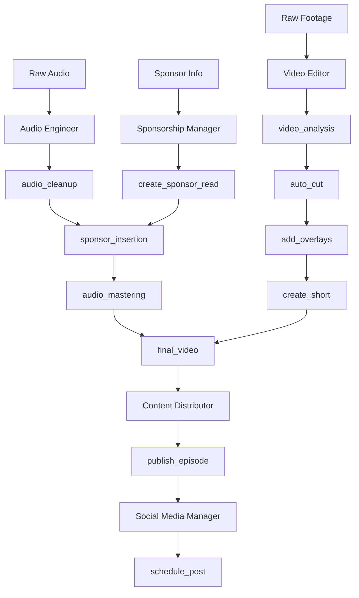
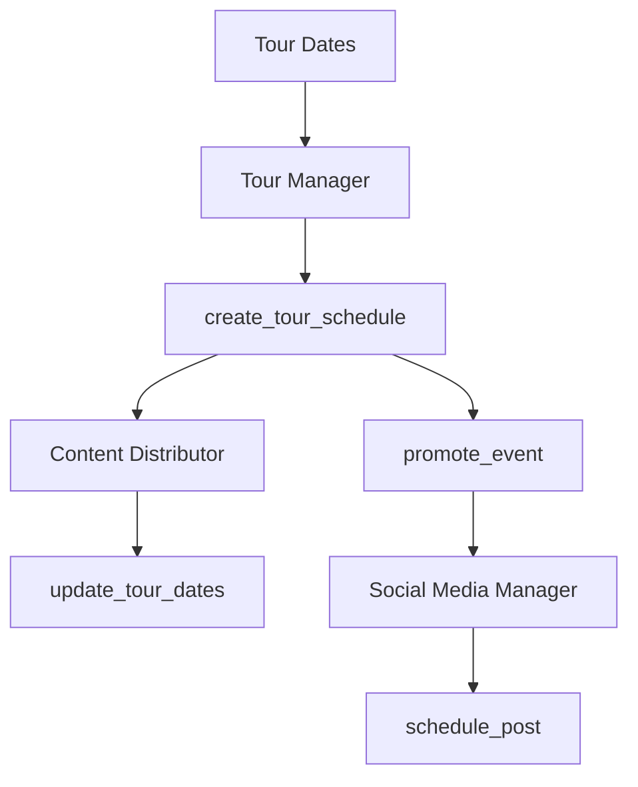

# Agents and Toolsets Documentation

This document provides comprehensive documentation of all agents and toolsets used in the podcast production workflow.

## Table of Contents

1. [Agents Overview](#agents-overview)
2. [Tool Schemas](#tool-schemas)
3. [MCP Servers](#mcp-servers)
4. [Toolsets Reference](#toolsets-reference)
5. [Workflows](#workflows)
6. [Configuration](#configuration)

---

## Agents Overview

### Agent Configuration (`agents_config.json`)

The project uses a centralized agent configuration file located at `agents_config.json`. This file defines all production agents, their roles, available tools, and workflows.

#### Agent Structure

```json
{
  "agents": {
    "<agent_name>": {
      "name": "Human-readable name",
      "role": "Brief role description",
      "model": "AI model to use",
      "system_prompt": "System prompt defining agent behavior",
      "tools": [
        {
          "name": "tool_name",
          "description": "Tool description",
          "type": "function",
          "inputSchema": {
            "type": "object",
            "required": ["required_param"],
            "properties": {
              "param_name": {
                "type": "string",
                "description": "Parameter description",
                "enum": ["value1", "value2"],
                "default": "value1"
              }
            }
          }
        }
      ]
    }
  }
}
```

### Core Agents

#### 1. Video Editor Agent

| Property  | Value                                                               |
| --------- | ------------------------------------------------------------------- |
| **Name**  | Podcast Video Editor                                                |
| **Role**  | Video production specialist focused on podcast content optimization |
| **Model** | gpt-4o                                                              |

**Responsibilities:**

- Analyzing multi-camera footage to identify and cut to active speakers
- Creating engaging short-form content (60-120 seconds) from long-form episodes
- Implementing professional color grading and visual effects
- Adding dynamic overlays, lower thirds, and branding elements
- Optimizing video for different platforms (YouTube, TikTok, Instagram, etc.)

**Tools:**

- [`video_analysis`](agents_config.json:11) - Analyze video footage for speaker detection
- [`auto_cut`](agents_config.json:37) - Automatically cut between camera angles
- [`create_short`](agents_config.json:65) - Generate short-form content
- [`add_overlays`](agents_config.json:100) - Add text overlays and visual elements

**Workflows:**

- `episode_edit`: video_analysis → auto_cut → add_overlays → export_final
- `short_creation`: video_analysis → create_short → add_captions → optimize_for_platform

---

#### 2. Audio Engineer Agent

| Property  | Value                                       |
| --------- | ------------------------------------------- |
| **Name**  | Audio Engineer                              |
| **Role**  | Audio production and enhancement specialist |
| **Model** | gpt-4o                                      |

**Responsibilities:**

- Cleaning up audio tracks using noise reduction, de-essing, and equalization
- Balancing multiple audio sources and applying compression
- Adding sponsor reads and advertisements seamlessly
- Mastering final audio for podcast platforms
- Creating audio versions for different platforms

**Tools:**

- [`audio_cleanup`](agents_config.json:179) - Remove background noise and artifacts
- [`voice_enhancement`](agents_config.json:214) - Enhance vocal clarity
- [`sponsor_insertion`](agents_config.json:248) - Insert sponsor reads at optimal points
- [`audio_mastering`](agents_config.json:287) - Master final audio for distribution

---

#### 3. Social Media Manager Agent

| Property  | Value                                                         |
| --------- | ------------------------------------------------------------- |
| **Name**  | Social Media Manager                                          |
| **Role**  | Multi-platform social media content management and scheduling |
| **Model** | gpt-4o                                                        |

**Responsibilities:**

- Creating platform-specific content strategies
- Scheduling posts in advance across all platforms
- Engaging with audience comments and messages
- Analyzing performance metrics and optimizing content
- Promoting tour dates and special events
- Managing sponsored content partnerships

**Tools:**

- [`create_content_calendar`](agents_config.json:339) - Generate posting schedule
- [`schedule_post`](agents_config.json:383) - Schedule posts across platforms
- [`engage_audience`](agents_config.json:470) - Monitor and respond to interactions
- [`analyze_performance`](agents_config.json:510) - Analyze post performance

---

#### 4. Content Distribution Manager Agent

| Property  | Value                                                        |
| --------- | ------------------------------------------------------------ |
| **Name**  | Content Distribution Manager                                 |
| **Role**  | Manage content publishing and website updates via Cloudflare |
| **Model** | gpt-4o                                                       |

**Responsibilities:**

- Publishing episodes to the website via Cloudflare Workers/Pages
- Updating tour dates and event information
- Managing SEO optimization and metadata
- Coordinating with podcast platforms
- Implementing CDN optimization
- Managing website assets and media files

**Tools:**

- [`publish_episode`](agents_config.json:618) - Publish new episode
- [`update_tour_dates`](agents_config.json:679) - Update tour schedule
- [`manage_cdn`](agents_config.json:715) - Optimize CDN settings
- [`seo_optimization`](agents_config.json:745) - Optimize content for search engines

---

#### 5. Sponsorship Manager Agent

| Property  | Value                                        |
| --------- | -------------------------------------------- |
| **Name**  | Sponsorship Manager                          |
| **Role**  | Manage sponsor relationships and integration |
| **Model** | gpt-4o                                       |

**Responsibilities:**

- Identifying and vetting potential sponsors
- Negotiating sponsorship deals and contracts
- Creating custom sponsor reads
- Tracking sponsorship performance and ROI
- Managing sponsor billing and reporting

**Tools:**

- [`sponsor_research`](agents_config.json:825) - Research potential sponsors
- [`create_sponsor_read`](agents_config.json:859) - Generate sponsor advertisements
- [`track_performance`](agents_config.json:903) - Monitor campaign performance
- [`generate_report`](agents_config.json:936) - Create performance reports

---

#### 6. Tour & Events Manager Agent

| Property  | Value                                                  |
| --------- | ------------------------------------------------------ |
| **Name**  | Tour & Events Manager                                  |
| **Role**  | Manage live events, tour dates, and venue coordination |
| **Model** | gpt-4o                                                 |

**Responsibilities:**

- Booking venues and managing tour logistics
- Coordinating with event promoters and local partners
- Managing ticket sales and audience engagement
- Creating promotional content for live shows
- Handling travel arrangements and scheduling

**Tools:**

- [`venue_research`](agents_config.json:980) - Research suitable venues
- [`create_tour_schedule`](agents_config.json:1014) - Generate tour itinerary
- [`manage_tickets`](agents_config.json:1047) - Handle ticket sales
- [`promote_event`](agents_config.json:1080) - Create promotional campaigns

---

### Monitoring Agent (`agents/monitoring_agent.py`)

A dedicated agent for monitoring stream quality, network traffic, and system health.

| Property  | Value                        |
| --------- | ---------------------------- |
| **File**  | `agents/monitoring_agent.py` |
| **Class** | `MonitoringAgent`            |

**Responsibilities:**

- Checking stream quality for configured URLs
- Monitoring network traffic on specified interfaces
- Checking system health metrics (CPU, memory, disk)

**Configuration Options:**

```json
{
  "base_dir": "/path/to/project",
  "log_dir": "logs",
  "interval": 60,
  "stream_urls": [],
  "network_interfaces": ["eth0", "wlan0"],
  "system_metrics": ["cpu", "memory", "disk"]
}
```

---

## Tool Schemas

All tools follow JSON Schema format with the following structure:

```json
{
  "name": "tool_name",
  "description": "Clear description of what the tool does",
  "type": "function",
  "inputSchema": {
    "type": "object",
    "required": ["param1", "param2"],
    "properties": {
      "param1": {
        "type": "string",
        "description": "Parameter description",
        "enum": ["value1", "value2"],
        "default": "value1"
      },
      "param2": {
        "type": "integer",
        "description": "Numeric parameter with constraints",
        "minimum": 0,
        "maximum": 100
      }
    }
  }
}
```

### Schema Properties

| Property     | Type   | Description                            |
| ------------ | ------ | -------------------------------------- |
| `type`       | string | Always "function" for tool definitions |
| `required`   | array  | List of required parameter names       |
| `properties` | object | Parameter definitions                  |
| `enum`       | array  | Allowed values for parameter           |
| `default`    | any    | Default value if not provided          |
| `minimum`    | number | Minimum numeric value                  |
| `maximum`    | number | Maximum numeric value                  |

---

## MCP Servers

### Social Media Manager Server (`mcp-servers/social-media-manager/`)

Node.js-based MCP server for comprehensive social media management.

| Property         | Value                                        |
| ---------------- | -------------------------------------------- |
| **Type**         | Stdio-based MCP Server                       |
| **Entry Point**  | `mcp-servers/social-media-manager/server.js` |
| **Node Version** | >=18.0.0                                     |

#### Configuration (`agents_config.json`)

```json
{
  "mcp_servers": {
    "social_media_manager": {
      "type": "stdio",
      "command": "node",
      "args": ["mcp-servers/social-media-manager/server.js"],
      "env": {
        "TWITTER_BEARER_TOKEN": "${TWITTER_BEARER_TOKEN}",
        "INSTAGRAM_ACCESS_TOKEN": "${INSTAGRAM_ACCESS_TOKEN}",
        "INSTAGRAM_BUSINESS_ID": "${INSTAGRAM_BUSINESS_ID}",
        "TIKTOK_ACCESS_TOKEN": "${TIKTOK_ACCESS_TOKEN}",
        "LINKEDIN_ACCESS_TOKEN": "${LINKEDIN_ACCESS_TOKEN}"
      },
      "enabled": true,
      "tools": [
        "post_to_twitter",
        "post_to_instagram",
        "post_to_tiktok",
        "upload_to_youtube",
        "post_to_linkedin",
        "cross_post",
        "get_analytics"
      ]
    }
  }
}
```

#### Available Tools

| Tool                                                                 | Description                | Input Schema                                              |
| -------------------------------------------------------------------- | -------------------------- | --------------------------------------------------------- |
| [`post_to_twitter`](mcp-servers/social-media-manager/server.js:34)   | Post content to Twitter/X  | `{content, media_path?, schedule_time?}`                  |
| [`post_to_instagram`](mcp-servers/social-media-manager/server.js:47) | Post content to Instagram  | `{content, media_path, media_type}`                       |
| [`post_to_tiktok`](mcp-servers/social-media-manager/server.js:60)    | Post content to TikTok     | `{content, video_path, hashtags?}`                        |
| [`upload_to_youtube`](mcp-servers/social-media-manager/server.js:73) | Upload content to YouTube  | `{title, description, video_path, tags?, schedule_time?}` |
| [`post_to_linkedin`](mcp-servers/social-media-manager/server.js:88)  | Post content to LinkedIn   | `{content, media_path?}`                                  |
| [`cross_post`](mcp-servers/social-media-manager/server.js:100)       | Post to multiple platforms | `{content, platforms, media_path?, platform_specific?}`   |
| [`get_analytics`](mcp-servers/social-media-manager/server.js:118)    | Get analytics data         | `{platforms, start_date?, end_date?, metrics?}`           |

#### Dependencies

```json
{
  "@modelcontextprotocol/sdk": "^1.0.0",
  "express": "^4.18.2",
  "axios": "^1.6.0",
  "multer": "^1.4.5-lts.1",
  "sharp": "^0.33.0",
  "fluent-ffmpeg": "^2.1.2",
  "node-cron": "^3.0.3",
  "dotenv": "^16.3.1",
  "winston": "^3.11.0",
  "joi": "^17.11.0"
}
```

---

## Toolsets Reference

### Video Editing Toolsets

| Tool             | Agent        | Description                             | Schema                         |
| ---------------- | ------------ | --------------------------------------- | ------------------------------ |
| `video_analysis` | Video Editor | Analyze footage for speaker detection   | [View](agents_config.json:11)  |
| `auto_cut`       | Video Editor | Cut between camera angles automatically | [View](agents_config.json:37)  |
| `create_short`   | Video Editor | Generate short-form clips               | [View](agents_config.json:65)  |
| `add_overlays`   | Video Editor | Add text overlays and branding          | [View](agents_config.json:100) |

### Audio Production Toolsets

| Tool                | Agent          | Description                 | Schema                         |
| ------------------- | -------------- | --------------------------- | ------------------------------ |
| `audio_cleanup`     | Audio Engineer | Noise reduction and cleanup | [View](agents_config.json:179) |
| `voice_enhancement` | Audio Engineer | Vocal clarity enhancement   | [View](agents_config.json:214) |
| `sponsor_insertion` | Audio Engineer | Insert sponsor reads        | [View](agents_config.json:248) |
| `audio_mastering`   | Audio Engineer | Final audio mastering       | [View](agents_config.json:287) |

### Social Media Toolsets

| Tool                      | Agent                | Description             | Schema                         |
| ------------------------- | -------------------- | ----------------------- | ------------------------------ |
| `create_content_calendar` | Social Media Manager | Plan content schedule   | [View](agents_config.json:339) |
| `schedule_post`           | Social Media Manager | Schedule posts          | [View](agents_config.json:383) |
| `engage_audience`         | Social Media Manager | Respond to interactions | [View](agents_config.json:470) |
| `analyze_performance`     | Social Media Manager | Performance analytics   | [View](agents_config.json:510) |

### Distribution Toolsets

| Tool                | Agent               | Description      | Schema                         |
| ------------------- | ------------------- | ---------------- | ------------------------------ |
| `publish_episode`   | Content Distributor | Publish episodes | [View](agents_config.json:618) |
| `update_tour_dates` | Content Distributor | Update tour info | [View](agents_config.json:679) |
| `manage_cdn`        | Content Distributor | CDN management   | [View](agents_config.json:715) |
| `seo_optimization`  | Content Distributor | SEO optimization | [View](agents_config.json:745) |

### Sponsorship Toolsets

| Tool                  | Agent               | Description      | Schema                         |
| --------------------- | ------------------- | ---------------- | ------------------------------ |
| `sponsor_research`    | Sponsorship Manager | Find sponsors    | [View](agents_config.json:825) |
| `create_sponsor_read` | Sponsorship Manager | Create ads       | [View](agents_config.json:859) |
| `track_performance`   | Sponsorship Manager | Track ROI        | [View](agents_config.json:903) |
| `generate_report`     | Sponsorship Manager | Generate reports | [View](agents_config.json:936) |

### Tour Management Toolsets

| Tool                   | Agent        | Description     | Schema                          |
| ---------------------- | ------------ | --------------- | ------------------------------- |
| `venue_research`       | Tour Manager | Find venues     | [View](agents_config.json:980)  |
| `create_tour_schedule` | Tour Manager | Plan tour       | [View](agents_config.json:1014) |
| `manage_tickets`       | Tour Manager | Ticket sales    | [View](agents_config.json:1047) |
| `promote_event`        | Tour Manager | Event promotion | [View](agents_config.json:1080) |

---

## Workflows

### Episode Production Workflow



### Tour Promotion Workflow



---

## Configuration

### Environment Variables

All sensitive configuration uses environment variables:

```bash
# OpenAI
OPENAI_API_KEY=${OPENAI_API_KEY}
OPENAI_ORG_ID=${OPENAI_ORG_ID}

# Cloudflare
CLOUDFLARE_API_TOKEN=${CLOUDFLARE_API_TOKEN}
CLOUDFLARE_ACCOUNT_ID=${CLOUDFLARE_ACCOUNT_ID}

# Social Platforms
TWITTER_API_KEY=${TWITTER_API_KEY}
TWITTER_API_SECRET=${TWITTER_API_SECRET}
TWITTER_BEARER_TOKEN=${TWITTER_BEARER_TOKEN}
INSTAGRAM_ACCESS_TOKEN=${INSTAGRAM_ACCESS_TOKEN}
INSTAGRAM_BUSINESS_ID=${INSTAGRAM_BUSINESS_ID}
TIKTOK_ACCESS_TOKEN=${TIKTOK_ACCESS_TOKEN}
YOUTUBE_API_KEY=${YOUTUBE_API_KEY}
```

### Model Configuration

| Model Type | Model Name               |
| ---------- | ------------------------ |
| Primary    | `gpt-4o`                 |
| Vision     | `gpt-4o-vision-preview`  |
| Audio      | `whisper-1`              |
| Embedding  | `text-embedding-3-large` |

---

## Dependencies

### Python Dependencies (`requirements.txt`)

- `click` - CLI framework
- `requests` - HTTP library
- `pytest` - Testing framework
- `requests-oauthlib` - OAuth support
- `google-auth` - Google authentication
- `google-api-python-client` - Google APIs
- `whisperx` - Audio transcription
- `sentence-transformers` - Text embeddings
- `faiss-cpu` - Vector similarity search

### MCP Server Dependencies (`requirements-mcp.txt`)

- `fastapi==0.104.1`
- `uvicorn==0.24.0`
- `pydantic==2.5.0`
- `requests==2.31.0`
- `aiohttp==3.9.0`
- `python-multipart==0.0.6`
- `Pillow==10.1.0`
- `moviepy==1.0.3`
- `pydub==0.25.1`
- `mcp-server==1.0.0`
- `asyncio-mqtt==0.16.1`
- `redis==5.0.1`
- `aioredis==2.0.1`
- `schedule==1.2.0`
- `python-dotenv==1.0.0`

---

## Validation

### Configuration Validation Commands

```bash
# Validate JSON configuration
python -m json.tool agents_config.json > /dev/null && echo "Valid JSON"

# Validate TOML configuration
python -c "import tomllib; tomllib.loads(open('config.toml').read())"

# Test MCP server
cd mcp-servers/social-media-manager && npm install && npm test
```

---

## Agent Configuration File (`agents/config.json`)

This file configures agent paths and validation:

```json
{
  "base_dir": "/home/cbwinslow/Documents/jcsnotfunny",
  "docs_dir": "docs",
  "scripts_dir": "scripts",
  "github_dir": ".github",
  "check_files": ["README.md", "CONTRIBUTING.md", "tasks.md", "ROADMAP.md", "agents.md"],
  "check_docs": ["SOPS.md", "DELIVERABLES.md", "ASSETS_INVENTORY.md", "SOCIAL_AUTOMATION.md"],
  "check_scripts": [
    "cli.py",
    "create_issues.sh",
    "ingest.py",
    "transcribe.py",
    "clip_generator.py",
    "publish.py",
    "mcp_publish.py",
    "social_publish.py",
    "social_workflows.py",
    "social_media_apis.py"
  ]
}
```
