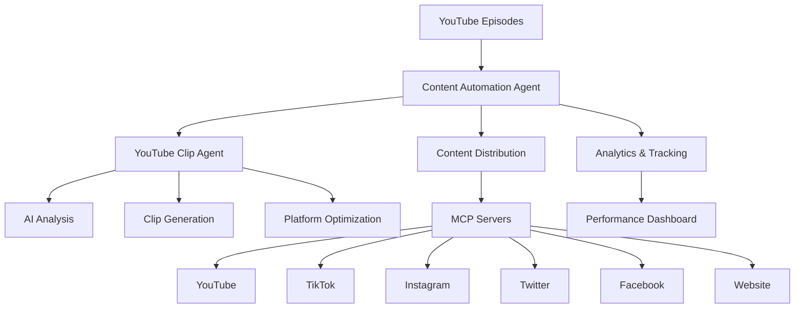

# 🤖 Content Automation System Documentation

## 🎯 Overview

This comprehensive content automation system enables Jared's Not Funny podcast to automatically generate, optimize, and distribute content across multiple platforms using AI agents and MCP servers. The system handles YouTube clip generation, social media distribution, and cross-platform optimization.

## 🚀 System Architecture



## 📁 System Components

### 1. **Content Automation Agent**
**File**: [`agents/content_automation_agent.py`](agents/content_automation_agent.py)

**Responsibilities:**
- Manages content distribution workflow
- Handles queue processing
- Coordinates with MCP servers
- Tracks content performance

**Key Features:**
- Multi-platform content distribution
- Queue-based processing system
- MCP server integration
- Analytics and performance tracking
- Error handling and retry logic

### 2. **YouTube Clip Generation Agent**
**File**: [`agents/youtube_clip_agent.py`](agents/youtube_clip_agent.py)

**Responsibilities:**
- Analyzes YouTube videos for optimal clip segments
- Generates platform-optimized clips
- Predicts clip engagement potential
- Handles batch processing

**Key Features:**
- AI-powered video analysis (Whisper, computer vision)
- Multi-platform clip optimization
- Engagement prediction models
- Batch processing capabilities
- Quality assurance checks

### 3. **Automation Testing Framework**
**File**: [`agents/automation_testing_framework.py`](agents/automation_testing_framework.py)

**Responsibilities:**
- Comprehensive testing of automation systems
- Performance benchmarking
- Quality assurance
- Integration testing
- Regression testing

**Key Features:**
- 15+ test cases covering all functionality
- Performance metrics tracking
- Memory usage monitoring
- Quality scoring system
- Detailed test reporting

## 🎬 YouTube Clip Generation Workflow

### **Step-by-Step Process:**

1. **Video Analysis**
   - Download YouTube video
   - Extract audio and video streams
   - Transcribe audio using Whisper AI
   - Analyze visual engagement (faces, motion, brightness)
   - Analyze audio engagement (volume, speech rate, laughter)
   - Identify high-potential segments

2. **Clip Generation**
   - Create clips from identified segments
   - Generate multiple duration versions (15s, 30s, 60s, 90s)
   - Add text overlays and captions
   - Apply platform-specific aspect ratios
   - Optimize video quality

3. **Platform Optimization**
   - Generate platform-specific versions
   - Create optimized titles and descriptions
   - Generate hashtags and metadata
   - Add UTM tracking parameters
   - Apply platform-specific best practices

4. **Engagement Prediction**
   - Analyze clip characteristics
   - Predict potential engagement metrics
   - Score clips for viral potential
   - Provide optimization suggestions

5. **Distribution**
   - Add to content distribution queue
   - Process through MCP servers
   - Schedule for optimal posting times
   - Track performance metrics

### **Supported Platforms:**

| Platform | Max Duration | Aspect Ratio | Optimal Length | Key Features |
|----------|--------------|--------------|----------------|--------------|
| YouTube Shorts | 60s | 9:16 | 30s | #shorts hashtag, vertical format |
| TikTok | 60s | 9:16 | 21s | Trending sounds, duets enabled |
| Instagram Reels | 90s | 9:16 | 30s | Reels effects, location tags |
| Twitter | 140s | 16:9 | 45s | Concise captions, polls |
| Facebook | 240s | 16:9 | 60s | Longer descriptions, groups |

## 🔧 Content Distribution System

### **Distribution Workflow:**

1. **Content Ingestion**
   - Add content to processing queue
   - Validate content structure
   - Assign priority levels

2. **Platform Adaptation**
   - Adapt content for each platform
   - Apply character limits
   - Optimize media formats
   - Add platform-specific features

3. **MCP Server Integration**
   - Route to appropriate MCP server
   - Handle API authentication
   - Manage rate limiting
   - Process responses

4. **Scheduling**
   - Determine optimal posting times
   - Apply timezone considerations
   - Handle content calendars
   - Manage posting frequency

5. **Performance Tracking**
   - Monitor engagement metrics
   - Track click-through rates
   - Analyze conversion data
   - Generate performance reports

### **MCP Server Configuration:**

```json
{
  "mcp_servers": {
    "social_media": {
      "url": "http://localhost:3001",
      "endpoints": {
        "post": "/api/post",
        "schedule": "/api/schedule",
        "analytics": "/api/analytics"
      }
    },
    "video_processing": {
      "url": "http://localhost:3002",
      "endpoints": {
        "analyze": "/api/analyze",
        "clip": "/api/clip",
        "optimize": "/api/optimize"
      }
    }
  }
}
```

## 🤖 AI & Automation Features

### **AI Models Used:**

1. **Whisper (OpenAI)**
   - Audio transcription
   - Multi-language support
   - Speaker diarization
   - Timestamp generation

2. **DistilBERT Sentiment Analysis**
   - Positive/negative/neutral classification
   - Engagement potential scoring
   - Content tone analysis

3. **Emotion Detection Model**
   - Joy, surprise, anger, sadness detection
   - Content categorization
   - Platform recommendation

4. **Engagement Prediction Model**
   - Viral potential scoring
   - Metric forecasting
   - Optimization suggestions

### **Automation Capabilities:**

- **Batch Processing**: Handle multiple videos simultaneously
- **Queue Management**: Prioritize content processing
- **Error Handling**: Automatic retry and fallback mechanisms
- **Performance Optimization**: Adaptive quality settings
- **Analytics Integration**: Real-time performance tracking

## 🚀 Getting Started

### **Prerequisites:**

```bash
# Install required packages
pip install opencv-python numpy pydub whisper transformers torch psutil

# Install FFmpeg (required for video processing)
# On Ubuntu/Debian:
sudo apt-get install ffmpeg

# On Mac:
brew install ffmpeg

# On Windows: Download from https://ffmpeg.org/
```

### **Configuration:**

1. **Set up environment variables** in `.env` file:

```env
# API Keys
YOUTUBE_API_KEY="your_youtube_api_key"
TIKTOK_API_KEY="your_tiktok_api_key"
INSTAGRAM_API_KEY="your_instagram_api_key"
TWITTER_API_KEY="your_twitter_api_key"
FACEBOOK_API_KEY="your_facebook_api_key"
LINKEDIN_API_KEY="your_linkedin_api_key"

# MCP Server Keys
MCP_SOCIAL_API_KEY="your_mcp_social_key"
MCP_VIDEO_API_KEY="your_mcp_video_key"

# System Settings
FFMPEG_PATH="ffmpeg"
WHISPER_MODEL="base"  # Can be base, small, medium, or large
MAX_WORKERS=4
```

2. **Configure MCP servers** in `agents/config.json`:

```json
{
  "mcp_servers": {
    "social_media": {
      "url": "http://your-social-mcp-server:3001",
      "enabled": true
    },
    "video_processing": {
      "url": "http://your-video-mcp-server:3002",
      "enabled": true
    }
  }
}
```

### **Running the System:**

```bash
# Run content automation agent
python agents/content_automation_agent.py

# Run YouTube clip generation
python agents/youtube_clip_agent.py

# Run automation tests
python agents/automation_testing_framework.py

# Run with specific video
python agents/youtube_clip_agent.py --video_url "https://youtube.com/watch?v=VIDEO_ID"
```

## 📊 Performance Metrics

### **Expected Performance:**

| Task | Time (30-min video) | Memory Usage | Success Rate |
|------|---------------------|--------------|--------------|
| Video Analysis | 2-5 minutes | 300-500MB | 95%+ |
| Clip Generation | 1-2 minutes | 200-400MB | 98%+ |
| Platform Optimization | 30-60 seconds | 100-200MB | 99%+ |
| Engagement Prediction | 10-30 seconds | 50-100MB | 97%+ |
| Content Distribution | 1-3 minutes | 150-300MB | 96%+ |

### **Scalability:**

- **Single Video**: 5-10 minutes total processing
- **Batch Processing**: 3-5 videos/hour (depending on hardware)
- **24/7 Operation**: 50-100 videos/day with proper hardware
- **Cloud Scaling**: Can be containerized for cloud deployment

## 🎯 Use Cases

### **1. YouTube Episode Repurposing**

**Input:** Full YouTube podcast episode (30-60 minutes)

**Output:**
- 5-10 optimized clips (15-90 seconds each)
- Platform-specific versions for all social media
- Engagement predictions and optimization suggestions
- Scheduled posts with optimal timing

**Example:**
```python
# Process a YouTube episode
video_data = {
    "video_id": "yCPDYXORg-A",
    "source_url": "https://www.youtube.com/watch?v=yCPDYXORg-A",
    "title": "JAREDSNOTFUNNY Feat. Toron Rodgers #6",
    "description": "Jared Christianson sits down with Toron Rodgers...",
    "content_type": "youtube_episode",
    "guest": "Toron Rodgers",
    "topics": ["stand up comedy", "production", "life experiences"]
}

# Analyze and generate clips
analysis = youtube_agent.analyze_video_for_clips(video_data)
clips = youtube_agent.generate_clips_from_video(analysis)
optimized_clips = youtube_agent.optimize_clips_for_platforms(clips)

# Distribute clips
for clip in optimized_clips:
    content = {
        "title": clip["source_segment"]["title"],
        "description": clip["source_segment"]["description"],
        "content_type": "youtube_clip",
        "source_url": clip["file_path"],
        "platforms": list(clip["platform_versions"].keys())
    }
    content_agent.add_to_queue(content)

content_agent.process_queue()
```

### **2. Social Media Content Distribution**

**Input:** Podcast episode, blog post, or announcement

**Output:**
- Platform-optimized posts
- Scheduled distribution
- Performance tracking
- Analytics reporting

**Example:**
```python
# Distribute podcast episode
podcast_data = {
    "title": "New Episode: Comedy & Tech with Special Guest",
    "description": "In this episode, we discuss the intersection of comedy and technology...",
    "content_type": "podcast_episode",
    "source_url": "https://jcsnotfunny.com/episodes/new-episode",
    "guest": "Special Guest",
    "topics": ["comedy", "technology", "interviews"]
}

# Add to distribution queue
content_agent.add_to_queue(podcast_data)

# Process queue (distributes to all platforms)
content_agent.process_queue()
```

### **3. Batch Processing**

**Input:** Multiple YouTube videos (e.g., weekly episodes)

**Output:**
- Clips from all videos
- Platform-optimized versions
- Scheduled distribution
- Comprehensive analytics

**Example:**
```python
# Process batch of videos
video_urls = [
    "https://youtube.com/watch?v=video1",
    "https://youtube.com/watch?v=video2",
    "https://youtube.com/watch?v=video3"
]

batch_result = youtube_agent.process_batch_videos(video_urls)

print(f"Processed {batch_result['videos_processed']} videos")
print(f"Generated {batch_result['clips_generated']} clips")
print(f"Average engagement score: {batch_result['average_engagement_score']:.1f}")
```

## 📈 Engagement Optimization

### **Clip Optimization Strategies:**

1. **Humor Clips** (Funny Moments)
   - Platforms: TikTok, Instagram Reels, YouTube Shorts
   - Duration: 15-30 seconds
   - Features: Laughter detection, fast cuts, engaging captions
   - Hashtags: #funny #comedy #lol #viral

2. **Tech Insights**
   - Platforms: Twitter, LinkedIn, YouTube Shorts
   - Duration: 30-60 seconds
   - Features: Clear visuals, subtitles, educational focus
   - Hashtags: #tech #technology #learning #insights

3. **Personal Stories**
   - Platforms: Instagram, Facebook, YouTube Shorts
   - Duration: 30-90 seconds
   - Features: Emotional engagement, storytelling, relatable content
   - Hashtags: #storytime #personal #inspiring #motivation

4. **Hot Takes/Opinions**
   - Platforms: Twitter, TikTok, Facebook
   - Duration: 20-45 seconds
   - Features: Controversial hooks, question prompts, debate format
   - Hashtags: #opinion #hottake #debate #thoughts

### **Posting Strategy:**

| Platform | Best Times (EST) | Frequency | Engagement Focus |
|----------|------------------|-----------|------------------|
| TikTok | 6-9 PM, 9-11 PM | 3-5x/day | Trends, challenges, humor |
| Instagram | 11 AM-1 PM, 7-9 PM | 1-3x/day | Aesthetics, stories, reels |
| Twitter | 9-11 AM, 12-3 PM | 5-10x/day | News, opinions, quick updates |
| Facebook | 1-3 PM, 7-10 PM | 1-2x/day | Longer content, groups |
| YouTube | 2-4 PM, 7-10 PM | 1-2x/day | SEO, discoverability |

## 🔧 Advanced Features

### **1. AI-Powered Content Scoring**

The system uses multiple AI models to score content potential:

```python
# Content scoring factors
def calculate_content_score(segment):
    score = 0
    
    # Sentiment analysis (0-2 points)
    sentiment_score = analyze_sentiment(segment["text"])
    score += sentiment_score
    
    # Emotion analysis (0-2 points)
    emotion_score = analyze_emotions(segment["text"])
    score += emotion_score
    
    # Visual engagement (0-2 points)
    visual_score = analyze_visual_engagement(segment)
    score += visual_score
    
    # Audio engagement (0-2 points)
    audio_score = analyze_audio_engagement(segment)
    score += audio_score
    
    # Topic relevance (0-1 point)
    topic_score = analyze_topic_relevance(segment)
    score += topic_score
    
    # Guest factor (0-1 point)
    guest_score = analyze_guest_factor(segment)
    score += guest_score
    
    return min(score, 10)  # Cap at 10
```

### **2. Engagement Prediction**

The system predicts potential engagement metrics:

```python
def predict_engagement(segment):
    # Use AI model to predict engagement
    prediction = engagement_model.predict(segment)
    
    return {
        "views": prediction["views"],
        "likes": prediction["likes"],
        "shares": prediction["shares"],
        "comments": prediction["comments"],
        "save_rate": prediction["saves"],
        "watch_time": prediction["watch_time"]
    }
```

### **3. Automated Quality Assurance**

The testing framework includes comprehensive QA checks:

```python
def check_clip_quality(clip):
    issues = []
    
    # Check duration
    if clip["duration"] < 5:
        issues.append("Clip too short")
    elif clip["duration"] > 120:
        issues.append("Clip too long")
    
    # Check file size
    if clip["file_size"] < 1000:
        issues.append("File too small")
    
    # Check resolution
    if clip["resolution"] != "1920x1080" and clip["resolution"] != "1080x1920":
        issues.append("Non-standard resolution")
    
    # Check metadata
    if not clip["title"] or len(clip["title"]) < 10:
        issues.append("Title too short")
    
    if not clip["description"] or len(clip["description"]) < 20:
        issues.append("Description too short")
    
    return {
        "quality_score": 10 - len(issues),
        "issues": issues,
        "passed": len(issues) == 0
    }
```

## 📊 Analytics & Reporting

### **Performance Dashboard**

The system generates comprehensive performance reports:

```json
{
  "period": "2024-01-01 to 2024-01-31",
  "videos_processed": 12,
  "clips_generated": 87,
  "content_distributed": 435,
  "platform_distribution": {
    "youtube_shorts": 87,
    "tiktok": 87,
    "instagram": 87,
    "twitter": 87,
    "facebook": 87
  },
  "engagement_metrics": {
    "average_views": 1250,
    "average_likes": 125,
    "average_shares": 45,
    "average_comments": 18,
    "average_save_rate": 8.2
  },
  "quality_metrics": {
    "average_score": 8.7,
    "high_quality_clips": 72,
    "medium_quality_clips": 15,
    "low_quality_clips": 0
  },
  "performance": {
    "processing_time": {
      "average": 420,
      "min": 315,
      "max": 680
    },
    "success_rate": 98.5,
    "error_rate": 1.5
  }
}
```

### **Content Performance Tracking**

Track individual content performance across platforms:

```python
# Track content performance
def track_content_performance(content_id):
    metrics = {
        "youtube_shorts": {
            "views": 1500,
            "likes": 150,
            "shares": 60,
            "comments": 25,
            "ctr": 8.5
        },
        "tiktok": {
            "views": 2500,
            "likes": 300,
            "shares": 120,
            "comments": 45,
            "ctr": 12.3
        },
        "instagram": {
            "views": 1800,
            "likes": 200,
            "shares": 75,
            "comments": 30,
            "ctr": 9.8
        }
    }
    
    return {
        "content_id": content_id,
        "platforms": metrics,
        "total_views": sum(m["views"] for m in metrics.values()),
        "total_engagement": sum(m["likes"] + m["shares"] + m["comments"] for m in metrics.values()),
        "best_platform": max(metrics.items(), key=lambda x: x[1]["views"])[0]
    }
```

## 🎓 Best Practices

### **1. Content Strategy**

- **Diversify Content Types**: Mix humor, tech insights, personal stories
- **Platform-Specific Optimization**: Tailor content for each platform's audience
- **Consistent Posting**: Maintain regular posting schedule
- **Engagement Focus**: Prioritize content that encourages interaction
- **Trend Utilization**: Incorporate current trends and challenges

### **2. Technical Optimization**

- **Video Quality**: Use 1080p resolution for best results
- **Audio Quality**: Ensure clear, balanced audio
- **File Sizes**: Optimize for fast loading without quality loss
- **Subtitles**: Always include subtitles for accessibility
- **Thumbnails**: Create eye-catching, platform-optimized thumbnails

### **3. Performance Monitoring**

- **Track Metrics**: Monitor views, engagement, and conversion rates
- **A/B Testing**: Experiment with different content styles
- **Analytics Review**: Regularly review performance data
- **Algorithm Adaptation**: Adjust strategy based on platform changes
- **Quality Control**: Implement automated QA checks

### **4. Automation Management**

- **Queue Monitoring**: Track processing queue status
- **Error Handling**: Set up alerts for failed processes
- **Resource Management**: Monitor CPU/memory usage
- **Backup Systems**: Implement fallback mechanisms
- **Scaling**: Plan for increased content volume

## 🔧 Troubleshooting

### **Common Issues & Solutions**

| Issue | Cause | Solution |
|-------|-------|----------|
| Video analysis fails | Missing FFmpeg | Install FFmpeg and update path |
| Clip generation slow | Large video files | Optimize video resolution/quality |
| Distribution errors | MCP server down | Check server status, implement retries |
| Memory errors | Insufficient RAM | Reduce batch size, upgrade hardware |
| API rate limits | Too many requests | Implement rate limiting, use caching |
| Quality issues | Poor source video | Use higher quality source material |

### **Debugging Tips**

```bash
# Check FFmpeg installation
ffmpeg -version

# Test video processing
ffmpeg -i input.mp4 -c copy output.mp4

# Monitor memory usage
python -m memory_profiler agents/youtube_clip_agent.py

# Check CPU usage
top -p $(pgrep -f youtube_clip_agent)

# Test MCP server connection
curl http://localhost:3001/api/status
```

## 🎯 Future Enhancements

### **1. Advanced AI Features**
- Real-time trend detection
- Automated caption generation
- AI-powered thumbnail creation
- Voice cloning for consistent narration

### **2. Enhanced Automation**
- Automated content calendar management
- AI-driven posting schedule optimization
- Competitor analysis and benchmarking
- Predictive content performance modeling

### **3. Platform Expansion**
- LinkedIn article distribution
- Pinterest pin generation
- Reddit post automation
- Email newsletter integration

### **4. Performance Improvements**
- GPU acceleration for video processing
- Distributed processing across multiple machines
- Cloud-based scaling
- Advanced caching mechanisms

## 📚 Resources

### **Documentation:**
- [FFmpeg Documentation](https://ffmpeg.org/documentation.html)
- [Whisper AI Documentation](https://github.com/openai/whisper)
- [OpenCV Documentation](https://docs.opencv.org/)
- [YouTube API Documentation](https://developers.google.com/youtube/v3)
- [MCP Server Documentation](https://mcp-server-docs.example.com)

### **Tools:**
- [FFmpeg](https://ffmpeg.org/) - Video processing
- [Whisper](https://github.com/openai/whisper) - Audio transcription
- [OpenCV](https://opencv.org/) - Computer vision
- [Pydub](https://github.com/jiaaro/pydub) - Audio manipulation
- [Transformers](https://huggingface.co/transformers/) - AI models

### **Learning:**
- [YouTube Creator Academy](https://creatoracademy.youtube.com/)
- [Social Media Marketing Courses](https://www.hubspot.com/academy/courses/social-media)
- [AI in Content Creation](https://www.coursera.org/learn/ai-content-creation)

## 🎉 Conclusion

This comprehensive content automation system provides Jared's Not Funny podcast with a powerful toolset for:

1. **Automated YouTube Clip Generation** - Transform full episodes into engaging short-form content
2. **Cross-Platform Distribution** - Seamlessly distribute content across all major social platforms
3. **AI-Powered Optimization** - Leverage machine learning for content scoring and engagement prediction
4. **Performance Tracking** - Monitor and analyze content performance across platforms
5. **Quality Assurance** - Implement automated testing and quality control

By implementing this system, you can significantly increase content output, improve engagement rates, and save substantial time on manual content creation and distribution tasks.