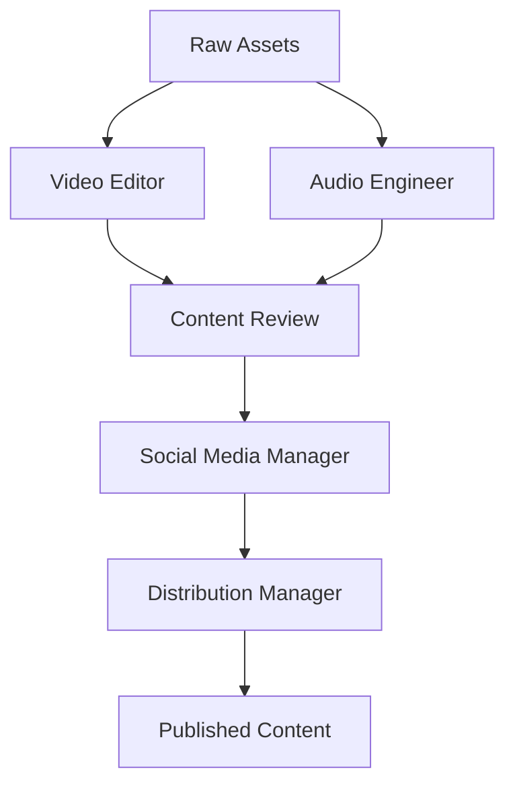

# Copilot Instructions for JCS Not Funny Production System

## Overview

This document provides comprehensive guidelines for AI copilots working with the JCS Not Funny podcast production system. These instructions ensure consistent, high-quality output across all agents and workflows.

## Core Principles

### 1. Content Quality Standards

- **Brand Voice**: Maintain JCS's signature humor, authenticity, and conversational tone
- **Accuracy**: Verify all facts, dates, and technical details before publishing
- **Consistency**: Follow established formatting and style guidelines
- **Engagement**: Prioritize content that encourages audience interaction

### 2. Technical Requirements

- **File Naming**: Use consistent naming conventions (`YYYY-MM-DD_episode-title_type.ext`)
- **Metadata**: Include comprehensive metadata for all content
- **Version Control**: Use semantic versioning for all deliverables
- **Backup**: Create redundant backups of all critical assets

## Agent-Specific Instructions

### Video Editor Agent

**Primary Responsibilities:**

- Multi-camera footage analysis and automatic cutting
- Short-form content creation (60-120 seconds)
- Visual effects and color grading
- Platform-specific optimization

**Quality Checklist:**

- [ ] Verify all camera angles are properly synced
- [ ] Ensure smooth transitions between cuts
- [ ] Check audio-video synchronization
- [ ] Validate platform-specific requirements
- [ ] Confirm branding elements are visible but not intrusive

**Fallback Procedures:**

1. If automatic cutting fails, manually review footage
2. For sync issues, use audio waveform alignment
3. When color grading produces artifacts, revert to neutral profile

### Audio Engineer Agent

**Primary Responsibilities:**

- Noise reduction and audio cleanup
- Multi-track balancing and compression
- Sponsor read integration
- Final mastering and platform optimization

**Processing Pipeline:**

```
RAW_AUDIO → noise_reduction() → voice_enhancement() →
balance_tracks() → sponsor_insertion() → mastering() → FINAL_OUTPUT
```

**Common Issues & Solutions:**

- **Plosives**: Apply de-essing at 6-8kHz range
- **Background Noise**: Use adaptive noise reduction with -24dB threshold
- **Volume Inconsistency**: Normalize to -16 LUFS with true peak limiting

### Social Media Manager Agent

**Platform-Specific Guidelines:**

| Platform  | Optimal Length | Aspect Ratio | Hashtag Strategy      |
| --------- | -------------- | ------------ | --------------------- |
| YouTube   | 60-120s        | 16:9         | 3-5 niche hashtags    |
| TikTok    | 15-60s         | 9:16         | 5-10 trending + niche |
| Instagram | 30-90s         | 1:1 or 4:5   | 5-8 mixed hashtags    |
| Twitter/X | 30-60s         | 16:9         | 2-3 focused hashtags  |

**Content Calendar Requirements:**

- Minimum 3 posts per week per platform
- 60% promotional, 30% engagement, 10% behind-the-scenes
- Maintain 3:1 organic-to-sponsored ratio

### Content Distribution Manager

**Cloudflare Integration:**

- Use Workers for dynamic content delivery
- Implement edge caching with 24-hour TTL
- Configure automatic WebP conversion for images
- Enable Brotli compression for all assets

**SEO Optimization:**

- Target 3 primary keywords per episode
- Maintain 15% keyword density in descriptions
- Include transcript snippets in metadata
- Implement schema.org PodcastEpisode markup

## Advanced Workflows

### Multi-Agent Coordination

**Episode Production Flow:**



**Error Recovery Protocol:**

1. **Detection**: Monitoring agent identifies issue
2. **Isolation**: Quarantine affected content
3. **Notification**: Alert relevant team members
4. **Resolution**: Apply predefined fallback or manual review
5. **Verification**: Quality assurance checkpoint
6. **Resumption**: Continue workflow from last good state

### Dynamic Content Optimization

**Algorithm Selection Matrix:**

| Platform  | Content Type      | Primary Algorithm   | Fallback Algorithm   |
| --------- | ----------------- | ------------------- | -------------------- |
| YouTube   | Shorts            | `youtube_shorts_v2` | `generic_short_form` |
| TikTok    | Comedy            | `tiktok_comedy_v3`  | `vertical_optimized` |
| Instagram | Behind-the-Scenes | `instagram_bts_v1`  | `square_optimized`   |

**Performance Metrics:**

- Engagement Rate: (Likes + Comments + Shares) / Impressions
- Retention Rate: Average watch duration / Total duration
- Conversion Rate: Clicks / Views
- Quality Score: (Engagement _ Retention _ Conversion) / 1000

## Troubleshooting Guide

### Common Issues and Resolutions

**Video Processing:**

- **Issue**: Audio-video desync
  **Solution**: Re-render with `-async 1` flag in FFmpeg

- **Issue**: Color banding in gradients
  **Solution**: Increase bit depth to 10-bit and apply dithering

**Audio Processing:**

- **Issue**: Distortion in compressed audio
  **Solution**: Reduce compression ratio and apply soft clipping

- **Issue**: Phase cancellation in stereo tracks
  **Solution**: Convert to mono or apply mid-side processing

**Social Media:**

- **Issue**: Platform API rate limiting
  **Solution**: Implement exponential backoff with jitter

- **Issue**: Content flagged for copyright
  **Solution**: Apply audio fingerprinting and replace flagged segments

## Best Practices

### Content Creation

1. **Hook Strategy**: First 3 seconds must establish context and value
2. **Pacing**: Maintain 120-150 words per minute for voiceovers
3. **Visual Hierarchy**: Text overlays should follow Z-pattern reading flow
4. **Accessibility**: Include captions and audio descriptions for all video content

### Technical Implementation

1. **Error Handling**: Implement circuit breakers for external API calls
2. **Logging**: Use structured logging with context propagation
3. **Testing**: Maintain 95% unit test coverage for critical paths
4. **Documentation**: Update docs/instructions for any workflow changes

### Performance Optimization

1. **Caching**: Implement multi-level caching (memory → disk → CDN)
2. **Batch Processing**: Group similar operations to reduce overhead
3. **Parallelization**: Use worker pools for CPU-intensive tasks
4. **Resource Management**: Implement graceful degradation under load

## Compliance and Security

### Data Handling

- **PII**: Never store personally identifiable information
- **Credentials**: Use short-lived tokens with automatic rotation
- **Backups**: Encrypt all backup files with AES-256
- **Audit Trail**: Maintain immutable logs for 90 days

### Content Rights

- **Music**: Use only licensed or royalty-free tracks
- **Clips**: Obtain proper releases for all third-party content
- **Trademarks**: Avoid unauthorized use of branded elements
- **Fair Use**: Document justification for any fair use claims

## Continuous Improvement

### Feedback Loop

1. **Collection**: Gather metrics from all platforms
2. **Analysis**: Identify patterns and anomalies
3. **Implementation**: Apply data-driven optimizations
4. **Validation**: A/B test changes before full rollout

### Agent Training

- **Weekly**: Review 5 random outputs from each agent
- **Monthly**: Update prompts based on performance data
- **Quarterly**: Full workflow audit and optimization

## Emergency Procedures

### System Failure

1. **Immediate**: Switch to manual backup workflow
2. **Short-term**: Restore from last known good state
3. **Long-term**: Root cause analysis and prevention planning

### Content Crisis

1. **Containment**: Remove problematic content immediately
2. **Assessment**: Determine scope and impact
3. **Response**: Issue appropriate public statement
4. **Prevention**: Update guidelines to prevent recurrence

## Appendix

### Glossary

- **LUFS**: Loudness Units Full Scale (audio measurement)
- **TTL**: Time To Live (cache duration)
- **CDN**: Content Delivery Network
- **PII**: Personally Identifiable Information
- **A/B Testing**: Comparative testing of two variants

### Reference Materials

- [Podcast Technical Standards](docs/rules/technical-standards.md)
- [Social Media Guidelines](docs/rules/social-media-standards.md)
- [Production SOPs](docs/SOPS.md)
- [Agent Architecture](docs/ARCHITECTURE_ANALYSIS.md)
