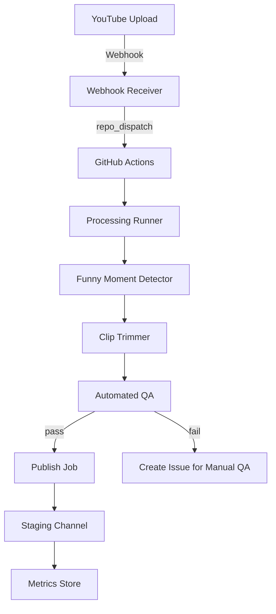

# Pipeline Documentation

This file expands on `pipelines/README.md` with more implementation guidance.

## Architecture (Mermaid)

## Implementation notes
- Webhook Receiver: small service that verifies YouTube notifications, then calls GitHub `repository_dispatch` to start the workflow with payload containing episode metadata.
- GitHub Actions runner: lightweight runner with a `content_pipeline` workflow that checks out the repo, sets up Python, installs deps, and runs `production_launcher.py --episode-id $EPISODE_ID`.

## Sample Commands
- Run locally: `GITHUB_REPO_OWNER=cbwinslow GITHUB_REPO_NAME=jcsnotfunny python production_launcher.py --episode-id <episode_id>`

## Testing
- Create fake YouTube event and confirm `repository_dispatch` triggers the workflow
- Verify artifact creation and automated QA checks

## Logging & Observability
- Use structured JSON logs and upload to `logs/` or to cloud logging
- Emit Prometheus-compatible metrics if using an observability stack

## Security
- Rotate publish tokens every 90 days
- Use least-privilege tokens scoped to staging during rollout

---

If you want, I can now create the sample GitHub Actions workflow and add a simple webhook receiver skeleton. What should I do next?