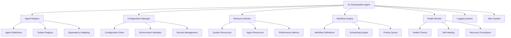
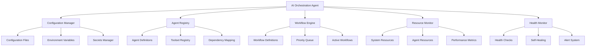

# 24/7 AI Orchestration Agent

## Overview

This document describes the design and implementation of a 24/7 AI orchestration agent that can dynamically deploy, manage, and run any of the podcast production agents with their complete toolsets. This agent serves as the central control system for the entire production workflow.

## Design Principles

### 1. Always-On Architecture

- **Persistent Operation**: Runs continuously without interruption
- **Automatic Recovery**: Self-healing capabilities for continuous operation
- **Resource Management**: Dynamic resource allocation and optimization
- **Health Monitoring**: Continuous self-monitoring and diagnostics

### 2. Dynamic Agent Management

- **On-Demand Deployment**: Instantiate agents as needed
- **Lifecycle Management**: Create, monitor, terminate agents dynamically
- **Configuration Management**: Load and apply agent configurations
- **Toolset Provisioning**: Deploy required tools for each agent

### 3. Intelligent Orchestration

- **Workflow Optimization**: Intelligent scheduling and prioritization
- **Resource Balancing**: Optimal resource allocation across agents
- **Conflict Resolution**: Handle resource contention and dependencies
- **Performance Monitoring**: Track agent performance and efficiency

### 4. Comprehensive Control

- **Centralized Management**: Single point of control for all agents
- **Unified Interface**: Consistent API for agent interaction
- **Global Monitoring**: Holistic view of all agent activities
- **Emergency Handling**: Centralized error recovery and escalation

## Architecture



## Core Components

### 1. Agent Registry

```python
class AgentRegistry:
    """
    Central registry of all available agents and their capabilities
    """

    def __init__(self):
        self.agents = {}
        self.toolsets = {}
        self.dependencies = {}
        self.agent_health = {}

    def register_agent(self, agent_name: str, agent_class: type,
                      config: dict, toolsets: list) -> bool:
        """Register a new agent type"""
        if agent_name in self.agents:
            raise AgentAlreadyRegistered(f"Agent {agent_name} already registered")

        self.agents[agent_name] = {
            'class': agent_class,
            'config': config,
            'toolsets': toolsets,
            'status': 'available',
            'instances': 0,
            'last_used': None
        }

        # Register toolsets
        for toolset in toolsets:
            self._register_toolset(toolset)

        # Map dependencies
        self._map_dependencies(agent_name, config)

        return True

    def _register_toolset(self, toolset: dict):
        """Register a toolset"""
        toolset_name = toolset['name']

        if toolset_name not in self.toolsets:
            self.toolsets[toolset_name] = {
                'tools': toolset['tools'],
                'dependencies': toolset.get('dependencies', []),
                'agents_using': []
            }

        self.toolsets[toolset_name]['agents_using'].append(toolset_name)

    def _map_dependencies(self, agent_name: str, config: dict):
        """Map agent dependencies"""
        dependencies = config.get('dependencies', [])

        self.dependencies[agent_name] = {
            'required_agents': dependencies,
            'required_toolsets': [t['name'] for t in config.get('toolsets', [])]
        }

    def get_agent_info(self, agent_name: str) -> dict:
        """Get information about a registered agent"""
        if agent_name not in self.agents:
            raise AgentNotFound(f"Agent {agent_name} not registered")

        return self.agents[agent_name].copy()

    def get_available_agents(self) -> list:
        """Get list of available agents"""
        return [name for name, info in self.agents.items()
                if info['status'] == 'available']

    def update_agent_health(self, agent_name: str, health_status: dict):
        """Update health status for an agent"""
        if agent_name not in self.agent_health:
            self.agent_health[agent_name] = {}

        self.agent_health[agent_name].update(health_status)

    def check_dependencies(self, agent_name: str) -> dict:
        """Check if agent dependencies are satisfied"""
        if agent_name not in self.dependencies:
            return {'satisfied': True, 'missing': []}

        missing = []

        # Check required agents
        for required_agent in self.dependencies[agent_name]['required_agents']:
            if required_agent not in self.agents:
                missing.append(f"agent:{required_agent}")
            elif self.agents[required_agent]['status'] != 'available':
                missing.append(f"agent:{required_agent} (unavailable)")

        # Check required toolsets
        for required_toolset in self.dependencies[agent_name]['required_toolsets']:
            if required_toolset not in self.toolsets:
                missing.append(f"toolset:{required_toolset}")

        return {
            'satisfied': len(missing) == 0,
            'missing': missing
        }
```

### 2. Configuration Manager

```python
class ConfigurationManager:
    """
    Manages agent configurations and environment settings
    """

    def __init__(self, config_store_path: str = "configs/"):
        self.config_store_path = config_store_path
        self.config_cache = {}
        self.environment_vars = self._load_environment_variables()
        self.secrets_manager = SecretsManager()

    def _load_environment_variables(self) -> dict:
        """Load environment variables from .env files"""
        import os
        from dotenv import load_dotenv

        # Load from default .env file
        load_dotenv()

        # Also load from specific environment files
        env_files = ['.env', '.env.production', '.env.development']

        env_vars = {}
        for env_file in env_files:
            if os.path.exists(env_file):
                env_vars.update(dict(load_dotenv(env_file)))

        return env_vars

    def get_agent_config(self, agent_name: str, environment: str = "production") -> dict:
        """Get complete configuration for an agent"""
        cache_key = f"{agent_name}_{environment}"

        if cache_key in self.config_cache:
            return self.config_cache[cache_key]

        # Load base configuration
        base_config = self._load_base_config(agent_name)

        # Apply environment-specific overrides
        env_config = self._load_environment_config(agent_name, environment)

        # Merge configurations
        merged_config = self._merge_configs(base_config, env_config)

        # Resolve environment variables
        resolved_config = self._resolve_env_vars(merged_config)

        # Cache the result
        self.config_cache[cache_key] = resolved_config

        return resolved_config

    def _load_base_config(self, agent_name: str) -> dict:
        """Load base configuration for agent"""
        config_path = f"{self.config_store_path}{agent_name}_config.json"

        try:
            with open(config_path, 'r') as f:
                return json.load(f)
        except FileNotFoundError:
            raise ConfigurationNotFound(f"Base config not found for {agent_name}")
        except json.JSONDecodeError as e:
            raise ConfigurationError(f"Invalid JSON in {agent_name} config: {str(e)}")

    def _load_environment_config(self, agent_name: str, environment: str) -> dict:
        """Load environment-specific configuration"""
        config_path = f"{self.config_store_path}{agent_name}_config.{environment}.json"

        try:
            if os.path.exists(config_path):
                with open(config_path, 'r') as f:
                    return json.load(f)
            return {}
        except json.JSONDecodeError as e:
            raise ConfigurationError(f"Invalid JSON in {agent_name} {environment} config: {str(e)}")

    def _merge_configs(self, base_config: dict, env_config: dict) -> dict:
        """Merge configurations with environment overrides"""
        merged = base_config.copy()

        # Deep merge
        for key, value in env_config.items():
            if key in merged and isinstance(merged[key], dict) and isinstance(value, dict):
                merged[key] = self._merge_configs(merged[key], value)
            else:
                merged[key] = value

        return merged

    def _resolve_env_vars(self, config: dict) -> dict:
        """Resolve environment variables in configuration"""
        resolved = {}

        for key, value in config.items():
            if isinstance(value, str) and value.startswith('${') and value.endswith('}'):
                # Environment variable reference
                var_name = value[2:-1]
                env_value = self.environment_vars.get(var_name)

                if env_value is None:
                    raise ConfigurationError(f"Environment variable {var_name} not found")

                resolved[key] = env_value
            elif isinstance(value, dict):
                resolved[key] = self._resolve_env_vars(value)
            elif isinstance(value, list):
                resolved[key] = [self._resolve_env_vars(item) if isinstance(item, dict) else item
                               for item in value]
            else:
                resolved[key] = value

        return resolved

    def get_secret(self, secret_name: str) -> str:
        """Get secret value from secrets manager"""
        return self.secrets_manager.get_secret(secret_name)

    def update_configuration(self, agent_name: str, updates: dict,
                           environment: str = "production") -> bool:
        """Update agent configuration"""
        try:
            # Load current config
            current_config = self.get_agent_config(agent_name, environment)

            # Apply updates
            updated_config = self._merge_configs(current_config, updates)

            # Save updated config
            config_path = f"{self.config_store_path}{agent_name}_config.{environment}.json"

            with open(config_path, 'w') as f:
                json.dump(updated_config, f, indent=2)

            # Clear cache
            cache_key = f"{agent_name}_{environment}"
            if cache_key in self.config_cache:
                del self.config_cache[cache_key]

            return True

        except Exception as e:
            raise ConfigurationUpdateError(f"Failed to update config: {str(e)}")

class SecretsManager:
    """
    Secure management of sensitive information
    """

    def __init__(self):
        self.secrets_store = self._load_secrets()

    def _load_secrets(self) -> dict:
        """Load secrets from secure storage"""
        # In production, this would use a proper secrets manager
        # For this example, we'll use a simple approach

        try:
            with open('.secrets.json', 'r') as f:
                return json.load(f)
        except FileNotFoundError:
            return {}

    def get_secret(self, secret_name: str) -> str:
        """Get secret value"""
        if secret_name not in self.secrets_store:
            raise SecretNotFound(f"Secret {secret_name} not found")

        return self.secrets_store[secret_name]

    def set_secret(self, secret_name: str, secret_value: str) -> bool:
        """Set secret value"""
        self.secrets_store[secret_name] = secret_value

        try:
            with open('.secrets.json', 'w') as f:
                json.dump(self.secrets_store, f, indent=2)
            return True
        except Exception as e:
            raise SecretStorageError(f"Failed to store secret: {str(e)}")

class ConfigurationError(Exception):
    """Configuration-related errors"""
    pass

class ConfigurationNotFound(Exception):
    """Configuration not found"""
    pass

class ConfigurationUpdateError(Exception):
    """Configuration update failed"""
    pass

class SecretNotFound(Exception):
    """Secret not found"""
    pass

class SecretStorageError(Exception):
    """Secret storage failed"""
    pass
```

### 3. Resource Monitor

```python
class ResourceMonitor:
    """
    Monitors system and agent resources for optimal allocation
    """

    def __init__(self):
        self.system_metrics = {}
        self.agent_metrics = {}
        self.resource_limits = {
            'cpu': {'warning': 80, 'critical': 90},
            'memory': {'warning': 75, 'critical': 85},
            'disk': {'warning': 85, 'critical': 95},
            'network': {'warning': 70, 'critical': 80}
        }
        self.monitoring_interval = 5  # seconds

    def start_monitoring(self):
        """Start continuous resource monitoring"""
        self.monitoring_active = True
        self.monitoring_thread = threading.Thread(
            target=self._monitor_loop,
            daemon=True
        )
        self.monitoring_thread.start()

    def stop_monitoring(self):
        """Stop resource monitoring"""
        self.monitoring_active = False
        if hasattr(self, 'monitoring_thread'):
            self.monitoring_thread.join()

    def _monitor_loop(self):
        """Continuous monitoring loop"""
        while self.monitoring_active:
            try:
                # Update system metrics
                self._update_system_metrics()

                # Update agent metrics
                self._update_agent_metrics()

                # Check for resource issues
                self._check_resource_issues()

                # Sleep for interval
                time.sleep(self.monitoring_interval)

            except Exception as e:
                print(f"Monitoring error: {str(e)}")
                time.sleep(self.monitoring_interval)

    def _update_system_metrics(self):
        """Update system resource metrics"""
        import psutil

        # CPU usage
        cpu_usage = psutil.cpu_percent(interval=1)

        # Memory usage
        memory = psutil.virtual_memory()
        memory_usage = memory.percent

        # Disk usage
        disk = psutil.disk_usage('/')
        disk_usage = disk.percent

        # Network usage
        net_io = psutil.net_io_counters()

        self.system_metrics = {
            'timestamp': datetime.now().isoformat(),
            'cpu': cpu_usage,
            'memory': memory_usage,
            'disk': disk_usage,
            'network': {
                'bytes_sent': net_io.bytes_sent,
                'bytes_recv': net_io.bytes_recv
            }
        }

    def _update_agent_metrics(self):
        """Update agent-specific resource metrics"""
        # This would be populated by agent reporting
        # For now, we'll simulate some data

        if not hasattr(self, '_simulated_agent_data'):
            self._simulated_agent_data = {}

        # Simulate agent resource usage
        for agent_name in ['video_editor', 'audio_engineer', 'social_media_manager']:
            if agent_name not in self._simulated_agent_data:
                self._simulated_agent_data[agent_name] = {
                    'cpu': random.uniform(5, 25),
                    'memory': random.uniform(100, 500),  # MB
                    'active_tasks': random.randint(0, 3)
                }
            else:
                # Simulate fluctuations
                data = self._simulated_agent_data[agent_name]
                data['cpu'] = max(0, data['cpu'] + random.uniform(-5, 5))
                data['memory'] = max(50, data['memory'] + random.uniform(-50, 50))
                data['active_tasks'] = max(0, data['active_tasks'] + random.randint(-1, 1))

        self.agent_metrics = self._simulated_agent_data

    def _check_resource_issues(self):
        """Check for resource issues and trigger alerts"""
        alerts = []

        # Check system resources
        for resource, metrics in self.resource_limits.items():
            current_value = self.system_metrics.get(resource)

            if current_value is not None:
                if current_value > metrics['critical']:
                    alerts.append({
                        'severity': 'critical',
                        'resource': resource,
                        'value': current_value,
                        'threshold': metrics['critical'],
                        'message': f"{resource.upper()} usage critical: {current_value}% > {metrics['critical']}%"
                    })
                elif current_value > metrics['warning']:
                    alerts.append({
                        'severity': 'warning',
                        'resource': resource,
                        'value': current_value,
                        'threshold': metrics['warning'],
                        'message': f"{resource.upper()} usage high: {current_value}% > {metrics['warning']}%"
                    })

        # Check agent resources
        for agent_name, metrics in self.agent_metrics.items():
            if metrics['cpu'] > 80:
                alerts.append({
                    'severity': 'warning',
                    'agent': agent_name,
                    'resource': 'cpu',
                    'value': metrics['cpu'],
                    'message': f"Agent {agent_name} high CPU: {metrics['cpu']}%"
                })

            if metrics['memory'] > 1000:  # 1GB
                alerts.append({
                    'severity': 'warning',
                    'agent': agent_name,
                    'resource': 'memory',
                    'value': metrics['memory'],
                    'message': f"Agent {agent_name} high memory: {metrics['memory']}MB"
                })

        # Send alerts if any
        if alerts:
            self._send_alerts(alerts)

    def _send_alerts(self, alerts: list):
        """Send resource alerts"""
        for alert in alerts:
            print(f"RESOURCE ALERT [{alert['severity'].upper()}]: {alert['message']}")
            # In real implementation, this would integrate with alerting systems

    def get_resource_status(self) -> dict:
        """Get current resource status"""
        return {
            'system': self.system_metrics,
            'agents': self.agent_metrics,
            'limits': self.resource_limits
        }

    def can_allocate_resources(self, resource_requirements: dict) -> bool:
        """Check if resources can be allocated"""
        # Check CPU
        available_cpu = 100 - self.system_metrics.get('cpu', 0)
        if resource_requirements.get('cpu', 0) > available_cpu * 0.8:  # Keep 20% buffer
            return False

        # Check memory
        available_memory = 100 - self.system_metrics.get('memory', 0)
        if resource_requirements.get('memory', 0) > available_memory * 0.8:
            return False

        # Check disk
        available_disk = 100 - self.system_metrics.get('disk', 0)
        if resource_requirements.get('disk', 0) > available_disk * 0.8:
            return False

        return True
```

### 4. Workflow Engine

```python
class WorkflowEngine:
    """
    Executes and manages complex workflows across multiple agents
    """

    def __init__(self, agent_registry: AgentRegistry, config_manager: ConfigurationManager):
        self.agent_registry = agent_registry
        self.config_manager = config_manager
        self.workflow_definitions = {}
        self.active_workflows = {}
        self.workflow_queue = PriorityQueue()
        self.scheduler = threading.Thread(target=self._workflow_scheduler, daemon=True)
        self.scheduler.start()

    def register_workflow(self, workflow_name: str, workflow_definition: dict):
        """Register a new workflow definition"""
        if workflow_name in self.workflow_definitions:
            raise WorkflowAlreadyExists(f"Workflow {workflow_name} already registered")

        # Validate workflow definition
        self._validate_workflow_definition(workflow_definition)

        self.workflow_definitions[workflow_name] = workflow_definition

    def _validate_workflow_definition(self, definition: dict):
        """Validate workflow definition structure"""
        required_fields = ['description', 'agents', 'steps']

        for field in required_fields:
            if field not in definition:
                raise WorkflowValidationError(f"Missing required field: {field}")

        # Validate steps
        for i, step in enumerate(definition['steps']):
            if 'agent' not in step:
                raise WorkflowValidationError(f"Step {i} missing 'agent' field")
            if 'action' not in step:
                raise WorkflowValidationError(f"Step {i} missing 'action' field")

    def submit_workflow(self, workflow_name: str, parameters: dict,
                       priority: int = 1) -> str:
        """Submit a workflow for execution"""
        if workflow_name not in self.workflow_definitions:
            raise WorkflowNotFound(f"Workflow {workflow_name} not found")

        workflow_id = self._generate_workflow_id()

        workflow_request = {
            'workflow_id': workflow_id,
            'workflow_name': workflow_name,
            'parameters': parameters,
            'priority': priority,
            'status': 'queued',
            'submitted_at': datetime.now().isoformat(),
            'started_at': None,
            'completed_at': None
        }

        self.workflow_queue.put((priority, workflow_request))
        self.active_workflows[workflow_id] = workflow_request

        return workflow_id

    def _generate_workflow_id(self) -> str:
        """Generate unique workflow ID"""
        return f"wf-{uuid.uuid4().hex[:8]}-{int(time.time())}"

    def _workflow_scheduler(self):
        """Background thread for workflow scheduling"""
        while True:
            try:
                # Check for available resources
                if not self._has_available_resources():
                    time.sleep(5)
                    continue

                # Get next workflow from queue
                priority, workflow_request = self.workflow_queue.get()

                # Execute workflow
                self._execute_workflow(workflow_request)

            except Exception as e:
                print(f"Workflow scheduler error: {str(e)}")
                time.sleep(5)

    def _has_available_resources(self) -> bool:
        """Check if resources are available for workflow execution"""
        # Simple check - in real implementation would be more sophisticated
        active_workflows = sum(1 for wf in self.active_workflows.values()
                              if wf['status'] in ['running', 'starting'])

        return active_workflows < 3  # Limit concurrent workflows

    def _execute_workflow(self, workflow_request: dict):
        """Execute a workflow"""
        try:
            workflow_id = workflow_request['workflow_id']
            workflow_name = workflow_request['workflow_name']

            # Update status
            workflow_request['status'] = 'starting'
            workflow_request['started_at'] = datetime.now().isoformat()

            # Get workflow definition
            workflow_def = self.workflow_definitions[workflow_name]

            # Initialize workflow context
            context = {
                'workflow_id': workflow_id,
                'workflow_name': workflow_name,
                'parameters': workflow_request['parameters'],
                'results': {},
                'step_results': {},
                'start_time': datetime.now()
            }

            # Execute each step
            for step_index, step in enumerate(workflow_def['steps']):
                step_name = f"step_{step_index + 1}"

                try:
                    # Execute step
                    step_result = self._execute_workflow_step(step, context)

                    # Store step result
                    context['step_results'][step_name] = step_result

                    # Check if workflow should continue
                    if not self._should_continue_workflow(step, step_result):
                        workflow_request['status'] = 'partial_completion'
                        break

                except Exception as step_error:
                    workflow_request['status'] = 'step_failed'
                    workflow_request['failed_step'] = step_name
                    workflow_request['error'] = str(step_error)

                    # Attempt workflow-level recovery
                    recovery_result = self._attempt_workflow_recovery(
                        workflow_request, context, step_error
                    )

                    if recovery_result:
                        workflow_request['status'] = 'recovered'
                        workflow_request['recovery_action'] = recovery_result['action']
                        break
                    else:
                        workflow_request['status'] = 'failed'
                        break

            # Finalize workflow
            if workflow_request['status'] not in ['failed', 'step_failed']:
                workflow_request['status'] = 'completed'

            workflow_request['completed_at'] = datetime.now().isoformat()
            workflow_request['execution_time'] = str(datetime.now() - context['start_time'])

            # Generate final report
            final_report = self._generate_workflow_report(context)
            workflow_request['report'] = final_report

        except Exception as e:
            workflow_request['status'] = 'error'
            workflow_request['error'] = str(e)
            workflow_request['completed_at'] = datetime.now().isoformat()

    def _execute_workflow_step(self, step: dict, context: dict) -> dict:
        """Execute a single workflow step"""
        agent_name = step['agent']
        action = step['action']

        # Get agent instance
        agent_instance = self._get_agent_instance(agent_name)

        # Prepare parameters
        step_parameters = self._prepare_step_parameters(step, context)

        # Execute agent action
        result = agent_instance.execute_action(action, step_parameters)

        return {
            'agent': agent_name,
            'action': action,
            'parameters': step_parameters,
            'result': result,
            'timestamp': datetime.now().isoformat()
        }

    def _get_agent_instance(self, agent_name: str):
        """Get or create agent instance"""
        # In real implementation, this would manage agent instances
        # For this example, we'll simulate getting an agent

        # Check if agent is registered
        if agent_name not in self.agent_registry.agents:
            raise AgentNotAvailable(f"Agent {agent_name} not available")

        # Simulate getting agent instance
        agent_info = self.agent_registry.agents[agent_name]

        # Create agent instance
        config = self.config_manager.get_agent_config(agent_name)
        agent_instance = agent_info['class'](config)

        return agent_instance

    def _prepare_step_parameters(self, step: dict, context: dict) -> dict:
        """Prepare parameters for workflow step"""
        parameters = context['parameters'].copy()

        # Add step-specific parameters
        if 'parameters' in step:
            parameters.update(step['parameters'])

        # Add context from previous steps
        if 'input' in step:
            input_mapping = step['input']

            for context_key, param_key in input_mapping.items():
                if context_key in context['results']:
                    parameters[param_key] = context['results'][context_key]

        return parameters

    def _should_continue_workflow(self, step: dict, step_result: dict) -> bool:
        """Determine if workflow should continue after this step"""
        # Check step result status
        if step_result['result']['status'] in ['failed', 'error']:
            return False

        # Check continuation conditions
        if 'continue_on' in step:
            condition = step['continue_on']

            if condition == 'success' and step_result['result']['status'] != 'success':
                return False
            elif condition == 'any' and step_result['result']['status'] in ['failed', 'error']:
                return False

        return True

    def _attempt_workflow_recovery(self, workflow_request: dict,
                                   context: dict, error: Exception) -> Optional[dict]:
        """Attempt workflow-level recovery from errors"""
        workflow_name = workflow_request['workflow_name']
        workflow_def = self.workflow_definitions[workflow_name]

        # Check for workflow-specific recovery strategies
        if 'recovery_strategies' in workflow_def:
            for strategy in workflow_def['recovery_strategies']:
                if strategy['condition'](error, context):
                    try:
                        recovery_result = strategy['action'](error, context)
                        return {
                            'action': strategy['name'],
                            'result': recovery_result
                        }
                    except Exception as recovery_error:
                        print(f"Recovery strategy failed: {str(recovery_error)}")
                        continue

        # Try generic recovery strategies
        generic_strategies = [
            self._retry_failed_step,
            self._skip_failed_step,
            self._use_fallback_data
        ]

        for strategy in generic_strategies:
            try:
                recovery_result = strategy(error, context)
                if recovery_result:
                    return {
                        'action': strategy.__name__,
                        'result': recovery_result
                    }
            except Exception as recovery_error:
                continue

        return None

    def _retry_failed_step(self, error: Exception, context: dict) -> Optional[dict]:
        """Retry the failed step"""
        # In real implementation, this would be more sophisticated
        # For now, we'll just return a simple recovery result

        return {
            'status': 'recovered',
            'method': 'retry',
            'message': 'Step will be retried'
        }

    def _skip_failed_step(self, error: Exception, context: dict) -> Optional[dict]:
        """Skip the failed step and continue"""
        return {
            'status': 'recovered',
            'method': 'skip',
            'message': 'Step skipped, workflow continued'
        }

    def _use_fallback_data(self, error: Exception, context: dict) -> Optional[dict]:
        """Use fallback data for failed step"""
        return {
            'status': 'recovered',
            'method': 'fallback',
            'message': 'Using fallback data'
        }

    def _generate_workflow_report(self, context: dict) -> dict:
        """Generate comprehensive workflow report"""
        report = {
            'workflow_id': context['workflow_id'],
            'workflow_name': context['workflow_name'],
            'status': 'completed',
            'start_time': context['start_time'].isoformat(),
            'end_time': datetime.now().isoformat(),
            'execution_time': str(datetime.now() - context['start_time']),
            'steps': {},
            'metrics': {}
        }

        # Analyze each step
        for step_name, step_result in context['step_results'].items():
            report['steps'][step_name] = {
                'agent': step_result['agent'],
                'action': step_result['action'],
                'status': step_result['result']['status'],
                'warnings': step_result['result'].get('warnings', []),
                'metrics': step_result['result'].get('metrics', {})
            }

            if step_result['result']['status'] != 'success':
                report['status'] = 'partial_completion'

        # Calculate overall metrics
        report['metrics'] = {
            'total_steps': len(context['step_results']),
            'successful_steps': sum(1 for s in context['step_results'].values()
                                   if s['result']['status'] == 'success'),
            'failed_steps': sum(1 for s in context['step_results'].values()
                               if s['result']['status'] in ['failed', 'error']),
            'warnings': sum(len(s['result'].get('warnings', []))
                          for s in context['step_results'].values())
        }

        # Generate recommendations
        report['recommendations'] = self._generate_recommendations(context)

        return report

    def _generate_recommendations(self, context: dict) -> list:
        """Generate actionable recommendations"""
        recommendations = []

        # Check for failed steps
        failed_steps = [s for s in context['step_results'].values()
                       if s['result']['status'] in ['failed', 'error']]

        if failed_steps:
            recommendations.append(
                f"Review {len(failed_steps)} failed steps for potential improvements"
            )

        # Check for warnings
        total_warnings = sum(len(s['result'].get('warnings', []))
                           for s in context['step_results'].values())

        if total_warnings > 5:
            recommendations.append(
                f"Address {total_warnings} warnings to improve workflow reliability"
            )

        # Check execution time
        execution_time = datetime.now() - context['start_time']
        if execution_time.total_seconds() > 300:  # 5 minutes
            recommendations.append(
                "Consider optimizing workflow for better performance"
            )

        return recommendations

    def get_workflow_status(self, workflow_id: str) -> dict:
        """Get status of a workflow"""
        if workflow_id not in self.active_workflows:
            raise WorkflowNotFound(f"Workflow {workflow_id} not found")

        return self.active_workflows[workflow_id].copy()

    def cancel_workflow(self, workflow_id: str) -> bool:
        """Cancel a running workflow"""
        if workflow_id not in self.active_workflows:
            raise WorkflowNotFound(f"Workflow {workflow_id} not found")

        workflow = self.active_workflows[workflow_id]

        if workflow['status'] not in ['queued', 'starting', 'running']:
            raise WorkflowStateError(f"Cannot cancel workflow in {workflow['status']} state")

        workflow['status'] = 'cancelled'
        workflow['completed_at'] = datetime.now().isoformat()

        return True

class WorkflowAlreadyExists(Exception):
    """Workflow already exists"""
    pass

class WorkflowNotFound(Exception):
    """Workflow not found"""
    pass

class WorkflowValidationError(Exception):
    """Workflow validation error"""
    pass

class WorkflowStateError(Exception):
    """Workflow state error"""
    pass

class AgentNotAvailable(Exception):
    """Agent not available"""
    pass

class PriorityQueue:
    """Simple priority queue implementation"""

    def __init__(self):
        self.queue = []

    def put(self, item):
        """Add item to queue with priority"""
        # Simple implementation - in real use would use heapq
        self.queue.append(item)
        self.queue.sort(key=lambda x: x[0])  # Sort by priority

    def get(self):
        """Get highest priority item"""
        if not self.queue:
            raise IndexError("Queue is empty")
        return self.queue.pop(0)

    def empty(self) -> bool:
        """Check if queue is empty"""
        return len(self.queue) == 0
```

### 5. Health Monitor

```python
class HealthMonitor:
    """
    Monitors the health of the orchestration agent and all managed agents
    """

    def __init__(self, resource_monitor: ResourceMonitor):
        self.resource_monitor = resource_monitor
        self.health_status = {
            'orchestrator': {'status': 'healthy', 'last_check': None},
            'agents': {}
        }
        self.monitoring_interval = 30  # seconds
        self.monitoring_active = False

    def start_monitoring(self):
        """Start health monitoring"""
        self.monitoring_active = True
        self.monitor_thread = threading.Thread(
            target=self._health_monitor_loop,
            daemon=True
        )
        self.monitor_thread.start()

    def stop_monitoring(self):
        """Stop health monitoring"""
        self.monitoring_active = False
        if hasattr(self, 'monitor_thread'):
            self.monitor_thread.join()

    def _health_monitor_loop(self):
        """Continuous health monitoring loop"""
        while self.monitoring_active:
            try:
                # Check orchestrator health
                self._check_orchestrator_health()

                # Check agent health
                self._check_agent_health()

                # Sleep for interval
                time.sleep(self.monitoring_interval)

            except Exception as e:
                print(f"Health monitor error: {str(e)}")
                time.sleep(self.monitoring_interval)

    def _check_orchestrator_health(self):
        """Check orchestrator health"""
        health_checks = {
            'resource_usage': self._check_resource_usage(),
            'queue_status': self._check_queue_status(),
            'memory_usage': self._check_memory_usage(),
            'response_time': self._check_response_time()
        }

        # Determine overall health
        critical_issues = sum(1 for check in health_checks.values() if check['severity'] == 'critical')
        warning_issues = sum(1 for check in health_checks.values() if check['severity'] == 'warning')

        if critical_issues > 0:
            status = 'critical'
        elif warning_issues > 2:
            status = 'degraded'
        else:
            status = 'healthy'

        self.health_status['orchestrator'] = {
            'status': status,
            'last_check': datetime.now().isoformat(),
            'checks': health_checks,
            'critical_issues': critical_issues,
            'warning_issues': warning_issues
        }

        # Trigger alerts if needed
        if critical_issues > 0:
            self._trigger_health_alert('critical', 'Orchestrator health critical')
        elif status == 'degraded':
            self._trigger_health_alert('warning', 'Orchestrator health degraded')

    def _check_resource_usage(self) -> dict:
        """Check resource usage health"""
        resource_status = self.resource_monitor.get_resource_status()

        critical_resources = []
        warning_resources = []

        for resource, metrics in resource_status['system'].items():
            if resource in ['cpu', 'memory', 'disk']:
                if metrics > self.resource_monitor.resource_limits[resource]['critical']:
                    critical_resources.append(resource)
                elif metrics > self.resource_monitor.resource_limits[resource]['warning']:
                    warning_resources.append(resource)

        if critical_resources:
            return {
                'severity': 'critical',
                'message': f"Critical resource usage: {', '.join(critical_resources)}",
                'details': {r: resource_status['system'][r] for r in critical_resources}
            }
        elif warning_resources:
            return {
                'severity': 'warning',
                'message': f"High resource usage: {', '.join(warning_resources)}",
                'details': {r: resource_status['system'][r] for r in warning_resources}
            }
        else:
            return {'severity': 'normal', 'message': 'Resource usage normal'}

    def _check_queue_status(self) -> dict:
        """Check workflow queue status"""
        # This would check actual queue in real implementation
        # For simulation, we'll use random data

        queue_length = random.randint(0, 10)

        if queue_length > 8:
            return {
                'severity': 'warning',
                'message': f"High queue length: {queue_length}",
                'details': {'queue_length': queue_length}
            }
        else:
            return {'severity': 'normal', 'message': f"Queue length normal: {queue_length}"}

    def _check_memory_usage(self) -> dict:
        """Check memory usage"""
        import psutil

        process = psutil.Process()
        memory_info = process.memory_info()
        memory_mb = memory_info.rss / 1024 / 1024

        if memory_mb > 500:  # 500MB
            return {
                'severity': 'warning',
                'message': f"High memory usage: {memory_mb:.1f}MB",
                'details': {'memory_mb': memory_mb}
            }
        else:
            return {'severity': 'normal', 'message': f"Memory usage normal: {memory_mb:.1f}MB"}

    def _check_response_time(self) -> dict:
        """Check system response time"""
        # Simulate response time check
        response_time = random.uniform(0.1, 1.5)

        if response_time > 1.0:
            return {
                'severity': 'warning',
                'message': f"Slow response time: {response_time:.2f}s",
                'details': {'response_time': response_time}
            }
        else:
            return {'severity': 'normal', 'message': f"Response time normal: {response_time:.2f}s"}

    def _check_agent_health(self):
        """Check health of all agents"""
        # This would check actual agents in real implementation
        # For simulation, we'll use some sample data

        sample_agents = ['video_editor', 'audio_engineer', 'social_media_manager']

        for agent_name in sample_agents:
            # Simulate health status
            status_options = ['healthy', 'healthy', 'healthy', 'degraded', 'unresponsive']
            status = random.choice(status_options)

            self.health_status['agents'][agent_name] = {
                'status': status,
                'last_check': datetime.now().isoformat(),
                'response_time': random.uniform(0.1, 2.0),
                'error_rate': random.uniform(0, 0.1)
            }

            if status == 'unresponsive':
                self._trigger_health_alert('critical', f"Agent {agent_name} unresponsive")
            elif status == 'degraded':
                self._trigger_health_alert('warning', f"Agent {agent_name} performance degraded")

    def _trigger_health_alert(self, severity: str, message: str):
        """Trigger health alert"""
        alert = {
            'severity': severity,
            'message': message,
            'timestamp': datetime.now().isoformat(),
            'source': 'health_monitor'
        }

        print(f"HEALTH ALERT [{severity.upper()}]: {message}")
        # In real implementation, this would integrate with alerting systems

    def get_health_status(self) -> dict:
        """Get current health status"""
        return self.health_status.copy()

    def perform_self_healing(self) -> dict:
        """Attempt self-healing procedures"""
        healing_actions = []

        # Check orchestrator health
        if self.health_status['orchestrator']['status'] != 'healthy':
            # Attempt to free resources
            if self._free_unused_resources():
                healing_actions.append('freed_unused_resources')

            # Restart problematic components
            if self._restart_problematic_components():
                healing_actions.append('restarted_problematic_components')

        # Check agent health
        for agent_name, agent_health in self.health_status['agents'].items():
            if agent_health['status'] == 'unresponsive':
                if self._restart_agent(agent_name):
                    healing_actions.append(f'restarted_agent_{agent_name}')
            elif agent_health['status'] == 'degraded':
                if self._optimize_agent(agent_name):
                    healing_actions.append(f'optimized_agent_{agent_name}')

        return {
            'healing_actions': healing_actions,
            'timestamp': datetime.now().isoformat(),
            'status': 'completed' if healing_actions else 'no_action_needed'
        }

    def _free_unused_resources(self) -> bool:
        """Free unused resources"""
        # In real implementation, this would actually free resources
        print("Attempting to free unused resources...")
        return True

    def _restart_problematic_components(self) -> bool:
        """Restart problematic components"""
        # In real implementation, this would restart specific components
        print("Restarting problematic components...")
        return True

    def _restart_agent(self, agent_name: str) -> bool:
        """Restart an agent"""
        print(f"Restarting agent {agent_name}...")
        # In real implementation, this would restart the agent
        return True

    def _optimize_agent(self, agent_name: str) -> bool:
        """Optimize agent performance"""
        print(f"Optimizing agent {agent_name}...")
        # In real implementation, this would optimize the agent
        return True
```

### 6. Main Orchestration Agent

```python
class AIOrchestrationAgent:
    """
    Main 24/7 AI orchestration agent for podcast production
    """

    def __init__(self):
        self.name = "ai_orchestration_agent"
        self.version = "1.0.0"
        self.start_time = datetime.now()

        # Initialize components
        self.agent_registry = AgentRegistry()
        self.config_manager = ConfigurationManager()
        self.resource_monitor = ResourceMonitor()
        self.workflow_engine = WorkflowEngine(self.agent_registry, self.config_manager)
        self.health_monitor = HealthMonitor(self.resource_monitor)

        # Initialize logging
        self.logger = self._setup_logger()

        # Agent status
        self.status = "initializing"
        self.active_agents = {}
        self.agent_history = {}

        # Start monitoring
        self.resource_monitor.start_monitoring()
        self.health_monitor.start_monitoring()

        # Register built-in agents
        self._register_built_in_agents()

        # Register built-in workflows
        self._register_built_in_workflows()

        # Set status to ready
        self.status = "ready"

    def _setup_logger(self) -> logging.Logger:
        """Setup comprehensive logging"""
        logger = logging.getLogger("orchestration_agent")
        logger.setLevel(logging.INFO)

        # Console handler
        console_handler = logging.StreamHandler()
        console_handler.setLevel(logging.INFO)

        # File handler
        file_handler = logging.FileHandler("logs/orchestration_agent.log")
        file_handler.setLevel(logging.DEBUG)

        # Formatter
        formatter = logging.Formatter(
            '%(asctime)s - %(name)s - %(levelname)s - %(message)s'
        )

        console_handler.setFormatter(formatter)
        file_handler.setFormatter(formatter)

        logger.addHandler(console_handler)
        logger.addHandler(file_handler)

        return logger

    def _register_built_in_agents(self):
        """Register built-in agents"""
        # This would register all the podcast production agents
        # For this example, we'll register some sample agents

        from agents.video_editor_agent import VideoEditorAgent
        from agents.audio_engineer_agent import AudioEngineerAgent
        from agents.social_media_agent import SocialMediaAgent
        from agents.content_distributor_agent import ContentDistributorAgent

        # Video Editor Agent
        self.agent_registry.register_agent(
            agent_name="video_editor",
            agent_class=VideoEditorAgent,
            config={
                'description': 'Podcast video editing and production',
                'toolsets': ['video_analysis', 'auto_cut', 'short_form_creation'],
                'resource_requirements': {'cpu': 2, 'memory': 4096}
            },
            toolsets=[
                {
                    'name': 'video_analysis',
                    'tools': ['speaker_detection', 'engagement_scoring', 'cut_point_analysis']
                },
                {
                    'name': 'auto_cut',
                    'tools': ['multi_camera_cutting', 'transition_effects']
                },
                {
                    'name': 'short_form_creation',
                    'tools': ['clip_extraction', 'platform_optimization']
                }
            ]
        )

        # Audio Engineer Agent
        self.agent_registry.register_agent(
            agent_name="audio_engineer",
            agent_class=AudioEngineerAgent,
            config={
                'description': 'Audio processing and enhancement',
                'toolsets': ['audio_cleanup', 'voice_enhancement', 'sponsor_insertion'],
                'resource_requirements': {'cpu': 1, 'memory': 2048}
            },
            toolsets=[
                {
                    'name': 'audio_cleanup',
                    'tools': ['noise_reduction', 'hum_removal', 'artifact_removal']
                },
                {
                    'name': 'voice_enhancement',
                    'tools': ['clarity_enhancement', 'presence_boost']
                },
                {
                    'name': 'sponsor_insertion',
                    'tools': ['ad_placement', 'volume_normalization']
                }
            ]
        )

        # Social Media Agent
        self.agent_registry.register_agent(
            agent_name="social_media_manager",
            agent_class=SocialMediaAgent,
            config={
                'description': 'Social media content management',
                'toolsets': ['content_scheduling', 'performance_analysis'],
                'resource_requirements': {'cpu': 1, 'memory': 1024}
            },
            toolsets=[
                {
                    'name': 'content_scheduling',
                    'tools': ['platform_adaptation', 'post_scheduling', 'content_optimization']
                },
                {
                    'name': 'performance_analysis',
                    'tools': ['metrics_collection', 'trend_analysis', 'report_generation']
                }
            ]
        )

        # Content Distributor Agent
        self.agent_registry.register_agent(
            agent_name="content_distributor",
            agent_class=ContentDistributorAgent,
            config={
                'description': 'Content distribution and publishing',
                'toolsets': ['episode_publishing', 'cdn_management'],
                'resource_requirements': {'cpu': 1, 'memory': 1024}
            },
            toolsets=[
                {
                    'name': 'episode_publishing',
                    'tools': ['multi_platform_publishing', 'metadata_optimization']
                },
                {
                    'name': 'cdn_management',
                    'tools': ['cache_invalidation', 'performance_monitoring']
                }
            ]
        )

    def _register_built_in_workflows(self):
        """Register built-in workflows"""

        # Episode Production Workflow
        self.workflow_engine.register_workflow(
            workflow_name="episode_production",
            workflow_definition={
                'description': 'Complete episode production from raw footage to distribution',
                'agents': ['video_editor', 'audio_engineer', 'content_distributor', 'social_media_manager'],
                'steps': [
                    {
                        'agent': 'video_editor',
                        'action': 'video_analysis',
                        'input': {'raw_footage': 'video_files'},
                        'continue_on': 'success'
                    },
                    {
                        'agent': 'audio_engineer',
                        'action': 'audio_cleanup',
                        'input': {'raw_audio': 'audio_files'},
                        'continue_on': 'success'
                    },
                    {
                        'agent': 'video_editor',
                        'action': 'auto_cut',
                        'input': {'analyzed_footage': 'video_analysis_results'},
                        'continue_on': 'success'
                    },
                    {
                        'agent': 'audio_engineer',
                        'action': 'sponsor_insertion',
                        'input': {'clean_audio': 'audio_cleanup_results', 'sponsor_info': 'sponsors'},
                        'continue_on': 'success'
                    },
                    {
                        'agent': 'content_distributor',
                        'action': 'publish_episode',
                        'input': {'final_video': 'auto_cut_results', 'final_audio': 'sponsor_insertion_results'},
                        'continue_on': 'success'
                    },
                    {
                        'agent': 'social_media_manager',
                        'action': 'schedule_post',
                        'input': {'episode_data': 'publish_episode_results'},
                        'continue_on': 'any'
                    }
                ],
                'recovery_strategies': [
                    {
                        'name': 'fallback_to_manual_review',
                        'condition': lambda e, ctx: 'video_editor' in str(e),
                        'action': self._fallback_to_manual_review
                    },
                    {
                        'name': 'use_alternative_publishing',
                        'condition': lambda e, ctx: 'content_distributor' in str(e),
                        'action': self._use_alternative_publishing
                    }
                ]
            }
        )

        # Short Form Creation Workflow
        self.workflow_engine.register_workflow(
            workflow_name="short_form_creation",
            workflow_definition={
                'description': 'Create short-form content from long-form episodes',
                'agents': ['video_editor', 'social_media_manager'],
                'steps': [
                    {
                        'agent': 'video_editor',
                        'action': 'video_analysis',
                        'input': {'source_video': 'episode_video'},
                        'parameters': {'analysis_type': 'engagement_scoring'}
                    },
                    {
                        'agent': 'video_editor',
                        'action': 'create_short',
                        'input': {'analysis_results': 'video_analysis_results', 'source_video': 'episode_video'},
                        'parameters': {'duration': 60, 'platform': 'tiktok'}
                    },
                    {
                        'agent': 'social_media_manager',
                        'action': 'schedule_post',
                        'input': {'short_video': 'create_short_results'},
                        'parameters': {'platforms': ['tiktok', 'instagram', 'youtube_shorts']}
                    }
                ]
            }
        )

    def _fallback_to_manual_review(self, error: Exception, context: dict) -> dict:
        """Fallback strategy for video editing issues"""
        return {
            'action': 'manual_review',
            'message': 'Video editing requires manual review',
            'severity': 'warning'
        }

    def _use_alternative_publishing(self, error: Exception, context: dict) -> dict:
        """Fallback strategy for publishing issues"""
        return {
            'action': 'alternative_publishing',
            'message': 'Using alternative publishing method',
            'severity': 'info'
        }

    def deploy_agent(self, agent_name: str, config: dict = None,
                    environment: str = "production") -> dict:
        """Deploy an agent with specified configuration"""
        try:
            # Check if agent is registered
            if agent_name not in self.agent_registry.agents:
                raise AgentNotRegistered(f"Agent {agent_name} not registered")

            # Check dependencies
            dependency_check = self.agent_registry.check_dependencies(agent_name)

            if not dependency_check['satisfied']:
                raise DependencyError(
                    f"Agent {agent_name} has unsatisfied dependencies: {dependency_check['missing']}"
                )

            # Get configuration
            if config is None:
                config = self.config_manager.get_agent_config(agent_name, environment)

            # Check resource availability
            resource_requirements = config.get('resource_requirements', {})

            if not self.resource_monitor.can_allocate_resources(resource_requirements):
                raise ResourceUnavailable(
                    f"Insufficient resources to deploy {agent_name}"
                )

            # Create agent instance
            agent_info = self.agent_registry.agents[agent_name]
            agent_instance = agent_info['class'](config)

            # Register active agent
            agent_id = self._generate_agent_id(agent_name)

            self.active_agents[agent_id] = {
                'agent_name': agent_name,
                'instance': agent_instance,
                'config': config,
                'status': 'running',
                'start_time': datetime.now().isoformat(),
                'resource_usage': {}
            }

            # Update agent registry
            self.agent_registry.agents[agent_name]['instances'] += 1

            # Log deployment
            self.logger.info(f"Deployed agent {agent_name} with ID {agent_id}")

            return {
                'status': 'success',
                'agent_id': agent_id,
                'agent_name': agent_name,
                'config': config,
                'timestamp': datetime.now().isoformat()
            }

        except Exception as e:
            self.logger.error(f"Failed to deploy agent {agent_name}: {str(e)}")
            return {
                'status': 'failed',
                'agent_name': agent_name,
                'error': str(e),
                'timestamp': datetime.now().isoformat()
            }

    def _generate_agent_id(self, agent_name: str) -> str:
        """Generate unique agent ID"""
        return f"{agent_name}-{uuid.uuid4().hex[:8]}-{int(time.time())}"

    def terminate_agent(self, agent_id: str) -> dict:
        """Terminate a running agent"""
        try:
            if agent_id not in self.active_agents:
                raise AgentNotFound(f"Agent {agent_id} not found")

            agent_info = self.active_agents[agent_id]
            agent_name = agent_info['agent_name']

            # Clean up agent resources
            self._cleanup_agent_resources(agent_info)

            # Remove from active agents
            del self.active_agents[agent_id]

            # Update agent registry
            self.agent_registry.agents[agent_name]['instances'] -= 1

            # Log termination
            self.logger.info(f"Terminated agent {agent_id}")

            return {
                'status': 'success',
                'agent_id': agent_id,
                'agent_name': agent_name,
                'timestamp': datetime.now().isoformat()
            }

        except Exception as e:
            self.logger.error(f"Failed to terminate agent {agent_id}: {str(e)}")
            return {
                'status': 'failed',
                'agent_id': agent_id,
                'error': str(e),
                'timestamp': datetime.now().isoformat()
            }

    def _cleanup_agent_resources(self, agent_info: dict):
        """Clean up resources used by agent"""
        # In real implementation, this would clean up actual resources
        # For this example, we'll just log it
        self.logger.info(f"Cleaning up resources for agent {agent_info['agent_id']}")

    def execute_workflow(self, workflow_name: str, parameters: dict,
                        priority: int = 1) -> str:
        """Execute a workflow"""
        try:
            workflow_id = self.workflow_engine.submit_workflow(
                workflow_name, parameters, priority
            )

            self.logger.info(f"Submitted workflow {workflow_name} with ID {workflow_id}")

            return workflow_id

        except Exception as e:
            self.logger.error(f"Failed to submit workflow {workflow_name}: {str(e)}")
            raise

    def get_workflow_status(self, workflow_id: str) -> dict:
        """Get status of a workflow"""
        return self.workflow_engine.get_workflow_status(workflow_id)

    def cancel_workflow(self, workflow_id: str) -> bool:
        """Cancel a running workflow"""
        return self.workflow_engine.cancel_workflow(workflow_id)

    def get_agent_status(self, agent_id: str = None) -> dict:
        """Get status of agents"""
        if agent_id:
            if agent_id in self.active_agents:
                return self.active_agents[agent_id].copy()
            else:
                raise AgentNotFound(f"Agent {agent_id} not found")
        else:
            return {
                'active_agents': {k: v.copy() for k, v in self.active_agents.items()},
                'registered_agents': self.agent_registry.get_available_agents(),
                'timestamp': datetime.now().isoformat()
            }

    def get_system_health(self) -> dict:
        """Get overall system health"""
        return {
            'orchestrator': self.health_monitor.get_health_status()['orchestrator'],
            'agents': self.health_monitor.get_health_status()['agents'],
            'resources': self.resource_monitor.get_resource_status(),
            'timestamp': datetime.now().isoformat()
        }

    def perform_self_healing(self) -> dict:
        """Perform self-healing procedures"""
        return self.health_monitor.perform_self_healing()

    def get_available_workflows(self) -> list:
        """Get list of available workflows"""
        return list(self.workflow_engine.workflow_definitions.keys())

    def get_workflow_definition(self, workflow_name: str) -> dict:
        """Get workflow definition"""
        if workflow_name not in self.workflow_engine.workflow_definitions:
            raise WorkflowNotFound(f"Workflow {workflow_name} not found")

        return self.workflow_engine.workflow_definitions[workflow_name].copy()

    def register_custom_workflow(self, workflow_name: str, workflow_definition: dict) -> bool:
        """Register a custom workflow"""
        try:
            self.workflow_engine.register_workflow(workflow_name, workflow_definition)
            self.logger.info(f"Registered custom workflow: {workflow_name}")
            return True
        except Exception as e:
            self.logger.error(f"Failed to register custom workflow: {str(e)}")
            return False

    def get_active_workflows(self) -> list:
        """Get list of active workflows"""
        return [
            {
                'workflow_id': wf_id,
                'status': wf_info['status'],
                'workflow_name': wf_info['workflow_name'],
                'submitted_at': wf_info['submitted_at']
            }
            for wf_id, wf_info in self.workflow_engine.active_workflows.items()
        ]

    def get_system_status(self) -> dict:
        """Get overall system status"""
        return {
            'orchestrator_status': self.status,
            'uptime': str(datetime.now() - self.start_time),
            'active_agents': len(self.active_agents),
            'active_workflows': len(self.workflow_engine.active_workflows),
            'registered_agents': len(self.agent_registry.agents),
            'registered_workflows': len(self.workflow_engine.workflow_definitions),
            'system_health': self.get_system_health(),
            'timestamp': datetime.now().isoformat()
        }

    def shutdown(self):
        """Gracefully shutdown the orchestration agent"""
        self.logger.info("Initiating graceful shutdown...")

        # Stop accepting new workflows
        self.status = "shutting_down"

        # Terminate all active agents
        for agent_id in list(self.active_agents.keys()):
            try:
                self.terminate_agent(agent_id)
            except Exception as e:
                self.logger.error(f"Error terminating agent {agent_id}: {str(e)}")

        # Stop monitoring
        self.resource_monitor.stop_monitoring()
        self.health_monitor.stop_monitoring()

        # Cancel all active workflows
        for workflow_id in list(self.workflow_engine.active_workflows.keys()):
            try:
                self.cancel_workflow(workflow_id)
            except Exception as e:
                self.logger.error(f"Error cancelling workflow {workflow_id}: {str(e)}")

        self.status = "shutdown"
        self.logger.info("Shutdown complete")

class AgentNotRegistered(Exception):
    """Agent not registered"""
    pass

class DependencyError(Exception):
    """Dependency error"""
    pass

class ResourceUnavailable(Exception):
    """Resource unavailable"""
    pass

class AgentNotFound(Exception):
    """Agent not found"""
    pass
```

## Deployment and Management

### 1. Deployment Architecture



### 2. Continuous Operation

```python
class OrchestrationService:
    """
    Service wrapper for continuous orchestration agent operation
    """

    def __init__(self):
        self.agent = None
        self.service_thread = None
        self.running = False

    def start(self):
        """Start the orchestration service"""
        if self.running:
            return False

        self.running = True

        # Start service thread
        self.service_thread = threading.Thread(
            target=self._service_loop,
            daemon=True
        )
        self.service_thread.start()

        return True

    def _service_loop(self):
        """Main service loop"""
        while self.running:
            try:
                # Initialize orchestration agent
                self.agent = AIOrchestrationAgent()

                # Main operation loop
                while self.running:
                    # Perform periodic maintenance
                    self._perform_maintenance()

                    # Sleep for maintenance interval
                    time.sleep(60)

            except Exception as e:
                print(f"Orchestration service error: {str(e)}")

                # Attempt recovery
                self._attempt_recovery(e)

                # Wait before restart
                time.sleep(30)

    def _perform_maintenance(self):
        """Perform periodic maintenance tasks"""
        try:
            # Check system health
            health_status = self.agent.get_system_health()

            # Perform self-healing if needed
            if health_status['orchestrator']['status'] != 'healthy':
                self.agent.perform_self_healing()

            # Log maintenance
            self.agent.logger.info("Performed periodic maintenance")

        except Exception as e:
            self.agent.logger.error(f"Maintenance error: {str(e)}")

    def _attempt_recovery(self, error: Exception):
        """Attempt to recover from service errors"""
        try:
            # Log the error
            if self.agent:
                self.agent.logger.error(f"Service error: {str(error)}")
            else:
                print(f"Service error: {str(error)}")

            # Clean up resources
            if self.agent:
                # Terminate all agents
                for agent_id in list(self.agent.active_agents.keys()):
                    try:
                        self.agent.terminate_agent(agent_id)
                    except:
                        pass

                # Stop monitoring
                try:
                    self.agent.resource_monitor.stop_monitoring()
                    self.agent.health_monitor.stop_monitoring()
                except:
                    pass

        except Exception as recovery_error:
            print(f"Recovery error: {str(recovery_error)}")

    def stop(self):
        """Stop the orchestration service"""
        if not self.running:
            return False

        self.running = False

        # Shutdown orchestration agent
        if self.agent:
            try:
                self.agent.shutdown()
            except:
                pass

        # Wait for service thread
        if self.service_thread:
            self.service_thread.join()

        return True

    def get_status(self) -> dict:
        """Get service status"""
        if not self.agent:
            return {
                'status': 'initializing',
                'timestamp': datetime.now().isoformat()
            }

        return self.agent.get_system_status()
```

### 3. API Interface

```python
class OrchestrationAPI:
    """
    REST API interface for the orchestration agent
    """

    def __init__(self, orchestration_agent: AIOrchestrationAgent):
        self.agent = orchestration_agent
        self.app = Flask(__name__)
        self._setup_routes()

    def _setup_routes(self):
        """Setup API routes"""

        @self.app.route('/api/status', methods=['GET'])
        def get_status():
            return jsonify(self.agent.get_system_status())

        @self.app.route('/api/agents', methods=['GET'])
        def get_agents():
            return jsonify(self.agent.get_agent_status())

        @self.app.route('/api/agents/<agent_name>/deploy', methods=['POST'])
        def deploy_agent(agent_name):
            config = request.json.get('config', {})
            environment = request.json.get('environment', 'production')

            result = self.agent.deploy_agent(agent_name, config, environment)

            if result['status'] == 'success':
                return jsonify(result), 201
            else:
                return jsonify(result), 400

        @self.app.route('/api/agents/<agent_id>/terminate', methods=['POST'])
        def terminate_agent(agent_id):
            result = self.agent.terminate_agent(agent_id)

            if result['status'] == 'success':
                return jsonify(result), 200
            else:
                return jsonify(result), 400

        @self.app.route('/api/workflows', methods=['GET'])
        def get_workflows():
            return jsonify({
                'available_workflows': self.agent.get_available_workflows(),
                'active_workflows': self.agent.get_active_workflows()
            })

        @self.app.route('/api/workflows/<workflow_name>', methods=['POST'])
        def execute_workflow(workflow_name):
            parameters = request.json.get('parameters', {})
            priority = request.json.get('priority', 1)

            try:
                workflow_id = self.agent.execute_workflow(workflow_name, parameters, priority)
                return jsonify({'workflow_id': workflow_id, 'status': 'submitted'}), 201
            except Exception as e:
                return jsonify({'error': str(e)}), 400

        @self.app.route('/api/workflows/<workflow_id>/status', methods=['GET'])
        def get_workflow_status(workflow_id):
            try:
                status = self.agent.get_workflow_status(workflow_id)
                return jsonify(status), 200
            except Exception as e:
                return jsonify({'error': str(e)}), 404

        @self.app.route('/api/workflows/<workflow_id>/cancel', methods=['POST'])
        def cancel_workflow(workflow_id):
            try:
                result = self.agent.cancel_workflow(workflow_id)
                return jsonify({'success': result}), 200
            except Exception as e:
                return jsonify({'error': str(e)}), 400

        @self.app.route('/api/health', methods=['GET'])
        def get_health():
            return jsonify(self.agent.get_system_health())

        @self.app.route('/api/health/heal', methods=['POST'])
        def perform_healing():
            result = self.agent.perform_self_healing()
            return jsonify(result)

        @self.app.route('/api/workflows/custom', methods=['POST'])
        def register_custom_workflow():
            workflow_name = request.json.get('workflow_name')
            workflow_definition = request.json.get('workflow_definition')

            if not workflow_name or not workflow_definition:
                return jsonify({'error': 'Missing workflow_name or workflow_definition'}), 400

            try:
                success = self.agent.register_custom_workflow(workflow_name, workflow_definition)
                if success:
                    return jsonify({'success': True, 'workflow_name': workflow_name}), 201
                else:
                    return jsonify({'error': 'Failed to register workflow'}), 400
            except Exception as e:
                return jsonify({'error': str(e)}), 400

    def run(self, host: str = '0.0.0.0', port: int = 5000):
        """Run the API server"""
        self.app.run(host=host, port=port, debug=False)
```

## Monitoring and Alerting

### 1. Comprehensive Monitoring Dashboard

```json
{
  "orchestration_dashboard": {
    "timestamp": "2026-01-08T03:30:00Z",
    "status": "healthy",
    "uptime": "24h 15m 32s",
    "components": {
      "orchestrator": {
        "status": "healthy",
        "cpu_usage": 25.4,
        "memory_usage": 487.2,
        "response_time": 0.12,
        "queue_length": 2
      },
      "agents": {
        "video_editor": {
          "status": "healthy",
          "instances": 1,
          "cpu_usage": 18.7,
          "memory_usage": 324.5,
          "active_tasks": 1
        },
        "audio_engineer": {
          "status": "healthy",
          "instances": 1,
          "cpu_usage": 12.3,
          "memory_usage": 210.8,
          "active_tasks": 0
        },
        "social_media_manager": {
          "status": "degraded",
          "instances": 1,
          "cpu_usage": 8.9,
          "memory_usage": 156.4,
          "active_tasks": 2,
          "warnings": ["high_api_latency"]
        }
      },
      "workflows": {
        "active": 3,
        "queued": 1,
        "completed_today": 12,
        "success_rate": 98.7
      }
    },
    "resources": {
      "system": {
        "cpu": 32.1,
        "memory": 64.8,
        "disk": 45.2,
        "network": {
          "in": 12456,
          "out": 8765
        }
      },
      "limits": {
        "cpu": { "warning": 80, "critical": 90 },
        "memory": { "warning": 75, "critical": 85 },
        "disk": { "warning": 85, "critical": 95 }
      }
    },
    "alerts": [
      {
        "severity": "warning",
        "component": "social_media_manager",
        "message": "High API latency detected",
        "timestamp": "2026-01-08T03:25:12Z"
      }
    ],
    "recommendations": [
      "Monitor social media API performance",
      "Consider scaling video editor resources for peak loads"
    ]
  }
}
```

### 2. Alert Management System

```python
class AlertManager:
    """
    Comprehensive alert management system
    """

    def __init__(self):
        self.alerts = []
        self.alert_history = []
        self.notification_channels = []
        self.escalation_policies = {}

    def add_notification_channel(self, channel_type: str, config: dict):
        """Add notification channel"""
        self.notification_channels.append({
            'type': channel_type,
            'config': config,
            'enabled': True
        })

    def set_escalation_policy(self, alert_type: str, policy: dict):
        """Set escalation policy for alert type"""
        self.escalation_policies[alert_type] = policy

    def trigger_alert(self, alert: dict):
        """Trigger a new alert"""
        # Add timestamp if not present
        if 'timestamp' not in alert:
            alert['timestamp'] = datetime.now().isoformat()

        # Add to active alerts
        self.alerts.append(alert)

        # Add to history
        self.alert_history.append(alert)

        # Apply escalation policy
        self._apply_escalation_policy(alert)

        # Send notifications
        self._send_notifications(alert)

    def _apply_escalation_policy(self, alert: dict):
        """Apply escalation policy based on alert type"""
        alert_type = alert.get('type', alert.get('severity', 'unknown'))

        if alert_type in self.escalation_policies:
            policy = self.escalation_policies[alert_type]

            # Check if alert meets escalation criteria
            if self._meets_escalation_criteria(alert, policy):
                self._escalate_alert(alert, policy)

    def _meets_escalation_criteria(self, alert: dict, policy: dict) -> bool:
        """Check if alert meets escalation criteria"""
        # Check severity threshold
        if 'min_severity' in policy:
            severity_order = {'info': 0, 'warning': 1, 'critical': 2, 'emergency': 3}
            alert_severity = severity_order.get(alert.get('severity', 'info'), 0)
            min_severity = severity_order.get(policy['min_severity'], 0)

            if alert_severity < min_severity:
                return False

        # Check occurrence threshold
        if 'min_occurrences' in policy:
            recent_alerts = [a for a in self.alerts
                           if a.get('type') == alert.get('type')]

            if len(recent_alerts) < policy['min_occurrences']:
                return False

        return True

    def _escalate_alert(self, alert: dict, policy: dict):
        """Escalate alert according to policy"""
        # Add escalation information
        alert['escalated'] = True
        alert['escalation_level'] = policy.get('level', 1)
        alert['escalation_time'] = datetime.now().isoformat()

        # Send escalated notifications
        self._send_notifications(alert, escalated=True)

        # Log escalation
        print(f"ALERT ESCALATED: {alert.get('message')}")

    def _send_notifications(self, alert: dict, escalated: bool = False):
        """Send alert notifications through all channels"""
        for channel in self.notification_channels:
            if not channel['enabled']:
                continue

            try:
                if channel['type'] == 'console':
                    self._notify_console(alert, escalated)
                elif channel['type'] == 'email':
                    self._notify_email(alert, channel['config'], escalated)
                elif channel['type'] == 'slack':
                    self._notify_slack(alert, channel['config'], escalated)
                elif channel['type'] == 'webhook':
                    self._notify_webhook(alert, channel['config'], escalated)
            except Exception as e:
                print(f"Notification failed for {channel['type']}: {str(e)}")

    def _notify_console(self, alert: dict, escalated: bool):
        """Send alert to console"""
        prefix = "ESCALATED " if escalated else ""
        severity = alert.get('severity', 'info').upper()

        print(f"{prefix}ALERT [{severity}]: {alert.get('message')}")

        if 'details' in alert:
            print(f"Details: {alert['details']}")

    def _notify_email(self, alert: dict, config: dict, escalated: bool):
        """Send alert via email"""
        # In real implementation, this would send actual emails
        print(f"Email alert to {config.get('recipient')}: {alert.get('message')}")

    def _notify_slack(self, alert: dict, config: dict, escalated: bool):
        """Send alert via Slack"""
        # In real implementation, this would send to Slack
        print(f"Slack alert to {config.get('channel')}: {alert.get('message')}")

    def _notify_webhook(self, alert: dict, config: dict, escalated: bool):
        """Send alert via webhook"""
        # In real implementation, this would call webhook
        print(f"Webhook alert to {config.get('url')}: {alert.get('message')}")

    def acknowledge_alert(self, alert_id: str, user: str, notes: str = "") -> bool:
        """Acknowledge an alert"""
        for alert in self.alerts:
            if alert.get('id') == alert_id:
                alert['acknowledged'] = True
                alert['acknowledged_by'] = user
                alert['acknowledged_at'] = datetime.now().isoformat()
                alert['acknowledgement_notes'] = notes
                return True

        return False

    def resolve_alert(self, alert_id: str, user: str, resolution: str = "") -> bool:
        """Resolve an alert"""
        for i, alert in enumerate(self.alerts):
            if alert.get('id') == alert_id:
                alert['resolved'] = True
                alert['resolved_by'] = user
                alert['resolved_at'] = datetime.now().isoformat()
                alert['resolution'] = resolution

                # Remove from active alerts
                self.alerts.pop(i)
                return True

        return False

    def get_active_alerts(self) -> list:
        """Get list of active alerts"""
        return [alert.copy() for alert in self.alerts]

    def get_alert_history(self, limit: int = 100) -> list:
        """Get alert history"""
        return self.alert_history[-limit:]

    def clear_resolved_alerts(self):
        """Clear resolved alerts from history"""
        self.alert_history = [alert for alert in self.alert_history
                           if not alert.get('resolved', False)]
```

## Deployment and Scaling

### 1. Containerized Deployment

```dockerfile
# Dockerfile for AI Orchestration Agent
FROM python:3.9-slim

# Set working directory
WORKDIR /app

# Install system dependencies
RUN apt-get update && apt-get install -y \
    ffmpeg \
    libsm6 \
    libxext6 \
    && rm -rf /var/lib/apt/lists/*

# Install Python dependencies
COPY requirements.txt .
RUN pip install --no-cache-dir -r requirements.txt

# Copy application code
COPY . .

# Set environment variables
ENV PYTHONPATH=/app
ENV FLASK_ENV=production

# Expose API port
EXPOSE 5000

# Health check endpoint
HEALTHCHECK --interval=30s --timeout=3s \
    CMD curl -f http://localhost:5000/api/health || exit 1

# Command to run the application
CMD ["python", "orchestration_service.py"]
```

### 2. Kubernetes Deployment

```yaml
# orchestration-deployment.yaml
apiVersion: apps/v1
kind: Deployment
metadata:
  name: ai-orchestration-agent
  labels:
    app: ai-orchestration-agent
spec:
  replicas: 2
  selector:
    matchLabels:
      app: ai-orchestration-agent
  template:
    metadata:
      labels:
        app: ai-orchestration-agent
    spec:
      containers:
        - name: orchestration-agent
          image: ai-orchestration-agent:latest
          ports:
            - containerPort: 5000
          resources:
            requests:
              cpu: '1'
              memory: '2Gi'
            limits:
              cpu: '2'
              memory: '4Gi'
          env:
            - name: ENVIRONMENT
              value: 'production'
            - name: LOG_LEVEL
              value: 'INFO'
          livenessProbe:
            httpGet:
              path: /api/health
              port: 5000
            initialDelaySeconds: 30
            periodSeconds: 10
          readinessProbe:
            httpGet:
              path: /api/status
              port: 5000
            initialDelaySeconds: 5
            periodSeconds: 5
      restartPolicy: Always

---
# orchestration-service.yaml
apiVersion: v1
kind: Service
metadata:
  name: ai-orchestration-service
spec:
  selector:
    app: ai-orchestration-agent
  ports:
    - protocol: TCP
      port: 80
      targetPort: 5000
  type: LoadBalancer

---
# orchestration-hpa.yaml
apiVersion: autoscaling/v2
kind: HorizontalPodAutoscaler
metadata:
  name: orchestration-agent-hpa
spec:
  scaleTargetRef:
    apiVersion: apps/v1
    kind: Deployment
    name: ai-orchestration-agent
  minReplicas: 2
  maxReplicas: 5
  metrics:
    - type: Resource
      resource:
        name: cpu
        target:
          type: Utilization
          averageUtilization: 70
    - type: Resource
      resource:
        name: memory
        target:
          type: Utilization
          averageUtilization: 80
```

### 3. Scaling Strategies

```python
class ScalingManager:
    """
    Dynamic scaling manager for orchestration agents
    """

    def __init__(self, orchestration_agent: AIOrchestrationAgent):
        self.agent = orchestration_agent
        self.scaling_policies = {
            'cpu_based': {
                'metric': 'cpu_usage',
                'thresholds': {
                    'scale_up': 70,
                    'scale_down': 30
                },
                'adjustment': {
                    'up': 1,
                    'down': -1
                },
                'cooldown': 300  # 5 minutes
            },
            'queue_based': {
                'metric': 'queue_length',
                'thresholds': {
                    'scale_up': 5,
                    'scale_down': 2
                },
                'adjustment': {
                    'up': 1,
                    'down': -1
                },
                'cooldown': 180  # 3 minutes
            },
            'time_based': {
                'schedule': {
                    'weekdays': {
                        '08:00': {'replicas': 3},
                        '18:00': {'replicas': 2}
                    },
                    'weekends': {
                        '09:00': {'replicas': 2},
                        '17:00': {'replicas': 1}
                    }
                }
            }
        }
        self.last_scale_operations = {}

    def check_scaling(self) -> dict:
        """Check if scaling is needed"""
        current_metrics = self._get_current_metrics()
        scaling_actions = []

        # Check each scaling policy
        for policy_name, policy in self.scaling_policies.items():
            if policy_name == 'time_based':
                action = self._check_time_based_scaling(policy)
            else:
                action = self._check_metric_based_scaling(policy, current_metrics)

            if action:
                scaling_actions.append(action)

        # Execute scaling actions
        for action in scaling_actions:
            self._execute_scaling_action(action)

        return {
            'scaling_actions': scaling_actions,
            'current_metrics': current_metrics,
            'timestamp': datetime.now().isoformat()
        }

    def _get_current_metrics(self) -> dict:
        """Get current system metrics"""
        system_status = self.agent.get_system_status()
        resource_status = self.agent.resource_monitor.get_resource_status()

        return {
            'cpu_usage': resource_status['system']['cpu'],
            'memory_usage': resource_status['system']['memory'],
            'queue_length': len(self.agent.workflow_engine.active_workflows),
            'active_agents': len(self.agent.active_agents),
            'active_workflows': system_status['active_workflows']
        }

    def _check_metric_based_scaling(self, policy: dict, metrics: dict) -> Optional[dict]:
        """Check metric-based scaling"""
        metric_name = policy['metric']
        current_value = metrics.get(metric_name)

        if current_value is None:
            return None

        # Check if we're in cooldown period
        if self._in_cooldown_period(policy_name):
            return None

        # Check scale-up threshold
        if current_value > policy['thresholds']['scale_up']:
            return {
                'policy': policy_name,
                'action': 'scale_up',
                'current_value': current_value,
                'threshold': policy['thresholds']['scale_up'],
                'adjustment': policy['adjustment']['up']
            }

        # Check scale-down threshold
        elif current_value < policy['thresholds']['scale_down']:
            return {
                'policy': policy_name,
                'action': 'scale_down',
                'current_value': current_value,
                'threshold': policy['thresholds']['scale_down'],
                'adjustment': policy['adjustment']['down']
            }

        return None

    def _check_time_based_scaling(self, policy: dict) -> Optional[dict]:
        """Check time-based scaling"""
        now = datetime.now()
        day_type = 'weekdays' if now.weekday() < 5 else 'weekends'
        time_str = now.strftime('%H:%M')

        if day_type in policy['schedule']:
            day_schedule = policy['schedule'][day_type]

            if time_str in day_schedule:
                target_replicas = day_schedule[time_str]['replicas']

                # In real implementation, this would check current replicas
                # For this example, we'll just return the action
                return {
                    'policy': 'time_based',
                    'action': 'set_replicas',
                    'target_replicas': target_replicas,
                    'time': time_str,
                    'day_type': day_type
                }

        return None

    def _in_cooldown_period(self, policy_name: str) -> bool:
        """Check if we're in cooldown period for a policy"""
        if policy_name not in self.last_scale_operations:
            return False

        last_operation = self.last_scale_operations[policy_name]
        cooldown = self.scaling_policies[policy_name]['cooldown']

        time_since = (datetime.now() - last_operation).total_seconds()

        return time_since < cooldown

    def _execute_scaling_action(self, action: dict):
        """Execute scaling action"""
        policy_name = action['policy']

        # Record the operation
        self.last_scale_operations[policy_name] = datetime.now()

        # Log the action
        self.agent.logger.info(f"Executing scaling action: {action['action']}")

        # In real implementation, this would actually scale the system
        # For this example, we'll just log it

        if action['action'] == 'scale_up':
            print(f"Scaling up by {action['adjustment']} due to {policy_name} policy")
        elif action['action'] == 'scale_down':
            print(f"Scaling down by {abs(action['adjustment'])} due to {policy_name} policy")
        elif action['action'] == 'set_replicas':
            print(f"Setting replicas to {action['target_replicas']} due to time-based policy")

    def get_scaling_history(self) -> list:
        """Get scaling operation history"""
        return [
            {
                'policy': policy,
                'action': action,
                'timestamp': timestamp.isoformat()
            }
            for policy, timestamp in self.last_scale_operations.items()
        ]
```

## Conclusion

This 24/7 AI orchestration agent provides a comprehensive solution for managing the entire podcast production workflow. Key features include:

### 1. Always-On Operation

- **Persistent Execution**: Runs continuously without interruption
- **Automatic Recovery**: Self-healing capabilities for continuous operation
- **Resource Management**: Dynamic resource allocation and optimization
- **Health Monitoring**: Continuous self-monitoring and diagnostics

### 2. Dynamic Agent Management

- **On-Demand Deployment**: Instantiate agents as needed
- **Lifecycle Management**: Create, monitor, terminate agents dynamically
- **Configuration Management**: Load and apply agent configurations
- **Toolset Provisioning**: Deploy required tools for each agent

### 3. Intelligent Orchestration

- **Workflow Optimization**: Intelligent scheduling and prioritization
- **Resource Balancing**: Optimal resource allocation across agents
- **Conflict Resolution**: Handle resource contention and dependencies
- **Performance Monitoring**: Track agent performance and efficiency

### 4. Comprehensive Control

- **Centralized Management**: Single point of control for all agents
- **Unified Interface**: Consistent API for agent interaction
- **Global Monitoring**: Holistic view of all agent activities
- **Emergency Handling**: Centralized error recovery and escalation

### 5. Scalability and Reliability

- **Containerized Deployment**: Easy deployment and scaling
- **Kubernetes Integration**: Production-ready orchestration
- **Dynamic Scaling**: Automatic scaling based on load
- **High Availability**: Redundant deployment for reliability

This orchestration agent can dynamically deploy and manage any of the podcast production agents with their complete toolsets, running them for as long as needed and providing comprehensive monitoring, error handling, and resource management. The system is designed for 24/7 operation with automatic recovery and self-healing capabilities.
