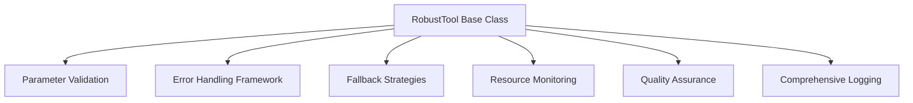
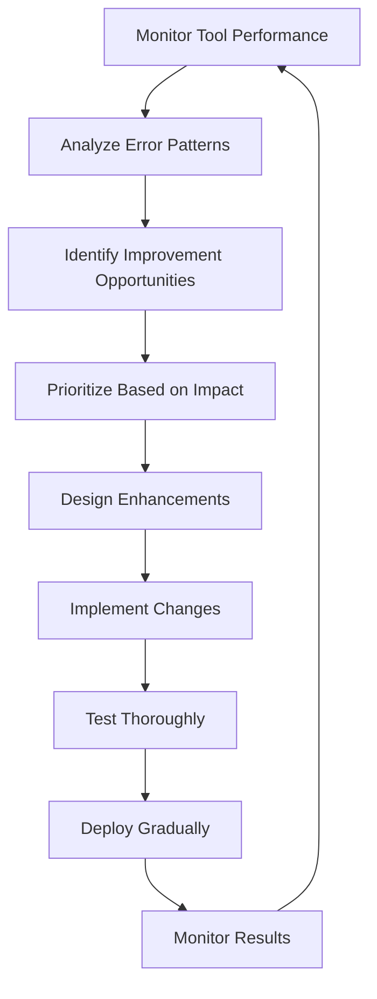

# Robust Toolset Design Summary

## Overview

This document summarizes the comprehensive toolset design for podcast production agents, focusing on robustness, usability, versatility, and reliability.

## Design Principles

### 1. Robustness First

- **Comprehensive Error Handling**: Every tool includes multiple fallback strategies
- **Input Validation**: Rigorous parameter validation with clear error messages
- **Graceful Degradation**: Tools provide partial results when possible
- **Resource Management**: Active monitoring of CPU, memory, and disk usage

### 2. Usability Focus

- **Clear Documentation**: Each tool has detailed usage examples and parameter descriptions
- **Informative Feedback**: Tools provide progress updates and detailed logging
- **Intuitive Interfaces**: Consistent parameter naming and structure across tools
- **Helpful Defaults**: Sensible default values for optional parameters

### 3. Versatility Requirements

- **Multi-Platform Support**: Tools adapt to different environments and platforms
- **Configurable Behavior**: Tools support various operating modes and quality levels
- **Extensible Design**: Easy to add new features without breaking existing functionality
- **Cross-Agent Compatibility**: Tools can be used by multiple agents in different contexts

### 4. Informative and Decisive

- **Detailed Logging**: Comprehensive execution logs with timestamps and context
- **Transparent Processes**: Clear explanations of tool decisions and actions
- **Quality Assurance**: Built-in validation and quality checks
- **Actionable Feedback**: Error messages include specific recovery suggestions

## Core Toolset Components

### 1. Base Tool Architecture



### 2. Standardized Tool Structure

```python
class RobustTool(ABC):
    def __init__(self, name: str, description: str):
        self.name = name
        self.description = description
        self.execution_id = None
        self.logger = self._setup_logger()
        self.retry_policy = self._default_retry_policy()
        self.fallback_strategies = self._define_fallback_strategies()

    def execute(self, parameters: Dict) -> ToolResult:
        # Comprehensive execution with safety measures
        pass

    def _validate_parameters(self, parameters: Dict) -> Dict:
        # Rigorous parameter validation
        pass

    def _execute_with_retry(self, func, *args, **kwargs) -> Any:
        # Intelligent retry logic
        pass

    def _apply_fallback_strategies(self, error: Exception, parameters: Dict) -> Optional[ToolResult]:
        # Multiple fallback options
        pass

    def _perform_quality_assurance(self, result: Any) -> List[str]:
        # Built-in quality checks
        pass
```

## Enhanced Toolset Definitions

### Video Editor Tools

#### 1. Video Analysis Tool

- **Purpose**: Comprehensive video analysis with speaker detection, engagement scoring, and technical quality assessment
- **Key Features**:
  - Multi-type analysis (speaker detection, engagement, cut points, technical quality)
  - Configurable confidence thresholds
  - Multiple output formats (JSON, XML, CSV)
  - Detailed progress reporting
- **Error Handling**:
  - File repair for corrupt videos
  - Quality reduction for memory constraints
  - Partial analysis for timeout scenarios
  - Comprehensive validation of video files

#### 2. Auto Cut Tool

- **Purpose**: Intelligent video cutting between camera angles
- **Key Features**:
  - Multiple cutting styles (dynamic, conservative, aggressive, custom)
  - Configurable transition effects
  - Audio synchronization
  - Backup and recovery options
- **Error Handling**:
  - Alternative encoder fallback
  - Quality reduction for resource constraints
  - Checkpoint-based recovery
  - Format validation and conversion

### Audio Engineer Tools

#### 1. Audio Cleanup Tool

- **Purpose**: Advanced noise reduction and audio enhancement
- **Key Features**:
  - Multiple noise reduction levels
  - Target noise profiles (studio, outdoor, conference, phone)
  - Real-time preview capability
  - Quality validation
- **Error Handling**:
  - Partial recovery for corrupt files
  - Chunked processing for large files
  - Format validation and conversion
  - Fallback to simpler algorithms

#### 2. Sponsor Insertion Tool

- **Purpose**: Context-aware sponsor read integration
- **Key Features**:
  - Multiple insertion points
  - Configurable transition styles
  - Volume normalization
  - Content relevance analysis
- **Error Handling**:
  - Manual review notification for content mismatches
  - Automatic correction for quality issues
  - Timing adjustment for synchronization
  - Validation of sponsor content

### Social Media Tools

#### 1. Content Scheduler

- **Purpose**: Intelligent multi-platform post scheduling
- **Key Features**:
  - Platform-specific content adaptation
  - Optimization strategies (engagement, reach, conversion)
  - Timezone-aware scheduling
  - Bulk scheduling capabilities
- **Error Handling**:
  - Rate limit handling with exponential backoff
  - Authentication token refresh
  - Content adaptation for validation errors
  - Alternative platform usage

#### 2. Performance Analyzer

- **Purpose**: Comprehensive performance analysis and insights
- **Key Features**:
  - Multi-platform analysis
  - Customizable metrics
  - Comparative analysis
  - Visual reporting options
- **Error Handling**:
  - Partial data analysis
  - Cached data fallback
  - Alternative data sources
  - Graceful degradation

### Content Distribution Tools

#### 1. Episode Publisher

- **Purpose**: Robust episode publishing to multiple platforms
- **Key Features**:
  - Multi-platform distribution
  - Scheduled and immediate publishing
  - Comprehensive validation
  - Metadata optimization
- **Error Handling**:
  - Rollback capabilities
  - Resume from checkpoint
  - Fallback content usage
  - Platform-specific error handling

#### 2. CDN Manager

- **Purpose**: Content delivery network optimization
- **Key Features**:
  - Cache invalidation
  - Performance monitoring
  - Traffic analysis
  - Configuration management
- **Error Handling**:
  - Partial cache updates
  - Fallback to default settings
  - Alternative CDN usage
  - Graceful degradation

## Implementation Framework

### 1. Error Handling Framework

```python
def execute_with_retry(tool_name, parameters, retry_policy):
    """Execute with intelligent retry logic"""
    attempt = 0
    last_error = None

    while attempt < retry_policy['max_attempts']:
        try:
            return execute_tool(tool_name, parameters)
        except Exception as e:
            last_error = e
            attempt += 1

            if not is_retryable_error(e, retry_policy):
                break

            delay = calculate_backoff_delay(attempt, retry_policy)
            time.sleep(delay)

    raise RetryExhaustedError(f"Tool failed after {retry_policy['max_attempts']} attempts")
```

### 2. Fallback Strategy Pattern

```python
def apply_fallback_strategies(error, fallback_config):
    """Apply configured fallback strategies"""
    for strategy in fallback_config:
        if strategy['condition'](error):
            try:
                result = strategy['action'](error)
                if result.successful:
                    return result
            except Exception as fb_error:
                log_fallback_failure(strategy['name'], fb_error)
                continue

    raise error  # Re-raise original error if all fallbacks fail
```

### 3. Validation System

```python
def validate_parameters(validation_schema, parameters):
    """Comprehensive parameter validation"""
    # Check required fields
    for field in validation_schema['required']:
        if field not in parameters:
            raise ValidationError(f"Missing required field: {field}")

    # Validate types and constraints
    for field, config in validation_schema['properties'].items():
        if field in parameters:
            validate_field(parameters[field], config)

    # Apply defaults
    for field, config in validation_schema['properties'].items():
        if field not in parameters and 'default' in config:
            parameters[field] = config['default']
```

## Integration Patterns

### 1. Agent-Tool Integration

```python
class VideoEditorAgent:
    def __init__(self):
        self.tools = {
            'video_analysis': VideoAnalysisTool(),
            'auto_cut': AutoCutTool(),
            'create_short': ShortFormCreator()
        }
        self.workflow_executor = WorkflowExecutor()

    def execute_workflow(self, workflow_name, parameters):
        workflow = self.workflow_executor.get_workflow(workflow_name)
        results = {}

        for step in workflow.steps:
            tool_result = self._execute_tool_safely(
                step.tool,
                self._prepare_parameters(step, parameters, results)
            )

            results[step.tool] = tool_result

            if not self._should_continue(step, tool_result):
                break

        return self.workflow_executor.finalize(workflow_name, results)
```

### 2. Cross-Agent Collaboration

```python
class ProductionOrchestrator:
    def __init__(self):
        self.agents = {
            'video_editor': VideoEditorAgent(),
            'audio_engineer': AudioEngineerAgent(),
            'content_distributor': ContentDistributorAgent()
        }

    def execute_protocol(self, protocol_name, parameters):
        protocol = self._get_protocol(protocol_name)
        results = {}

        for phase in protocol.phases:
            agent_result = self._execute_agent_phase(
                phase.agent,
                phase.workflow,
                self._prepare_phase_parameters(phase, parameters, results)
            )

            results[phase.name] = agent_result

            if not self._should_continue_protocol(phase, agent_result):
                break

        return self._generate_final_report(protocol_name, results)
```

## Monitoring and Maintenance

### 1. Performance Monitoring Dashboard

```json
{
  "dashboard": "Tool Performance Monitoring",
  "metrics": {
    "success_rate": 98.7,
    "average_execution_time": "2.4s",
    "error_rate": "2.8 per 1000 executions",
    "fallback_usage": "15 times last 24h"
  },
  "platform_specific": {
    "twitter": {
      "success_rate": 99.1,
      "api_errors": 0.5,
      "rate_limit_hits": 0.3
    },
    "instagram": {
      "success_rate": 97.8,
      "validation_errors": 1.2,
      "content_adaptations": 2.1
    }
  },
  "alerts": [
    {
      "severity": "warning",
      "message": "Memory usage approaching threshold",
      "metric": "memory_usage",
      "value": 68
    }
  ]
}
```

### 2. Continuous Improvement Process



## Key Benefits

### 1. Reliability

- **High Success Rates**: Comprehensive error handling ensures tools complete successfully
- **Graceful Degradation**: Partial results when full execution isn't possible
- **Automatic Recovery**: Intelligent retry and fallback mechanisms
- **Resource Management**: Active monitoring prevents resource exhaustion

### 2. Usability

- **Clear Documentation**: Easy to understand and use
- **Informative Feedback**: Users know what's happening and why
- **Helpful Error Messages**: Specific guidance for issue resolution
- **Progress Tracking**: Visibility into long-running operations

### 3. Versatility

- **Multi-Platform Support**: Works across different environments
- **Configurable Behavior**: Adapts to different use cases
- **Extensible Design**: Easy to add new features
- **Cross-Agent Compatibility**: Reusable across different agents

### 4. Maintainability

- **Comprehensive Logging**: Detailed records for debugging
- **Performance Monitoring**: Continuous quality assessment
- **Automated Testing**: Rigorous validation frameworks
- **Clear Architecture**: Well-structured and documented code

## Implementation Roadmap

### Phase 1: Foundation (2-4 weeks)

- [ ] Implement RobustTool base class
- [ ] Create error handling framework
- [ ] Build validation system
- [ ] Develop fallback strategy pattern
- [ ] Implement comprehensive logging
- [ ] Create basic monitoring dashboard

### Phase 2: Core Tools (4-6 weeks)

- [ ] Video Analysis Tool
- [ ] Audio Cleanup Tool
- [ ] Content Scheduler
- [ ] Episode Publisher
- [ ] Basic agent integration

### Phase 3: Advanced Features (3-5 weeks)

- [ ] Enhanced error recovery
- [ ] Performance optimization
- [ ] Cross-agent collaboration
- [ ] Advanced monitoring
- [ ] Automated testing framework

### Phase 4: Refinement (2-3 weeks)

- [ ] User testing and feedback
- [ ] Documentation completion
- [ ] Performance tuning
- [ ] Final validation
- [ ] Deployment preparation

## Success Metrics

### 1. Technical Metrics

- **Tool Success Rate**: Target ≥ 98%
- **Error Recovery Rate**: Target ≥ 90%
- **Average Execution Time**: Within acceptable thresholds
- **Resource Utilization**: Below warning thresholds
- **Test Coverage**: ≥ 90% code coverage

### 2. User Metrics

- **User Satisfaction**: ≥ 4.5/5 rating
- **Error Resolution Time**: ≤ 5 minutes average
- **Training Time**: ≤ 1 hour for new users
- **Documentation Effectiveness**: ≤ 1 support request per 100 executions

### 3. Business Metrics

- **Production Efficiency**: ≥ 30% improvement
- **Error Reduction**: ≥ 50% fewer production errors
- **Content Quality**: ≥ 20% improvement in quality scores
- **Platform Compliance**: ≥ 95% first-time success rate

## Best Practices

### 1. Development Best Practices

- **Modular Design**: Keep tools focused and single-purpose
- **Comprehensive Testing**: Test all code paths including error conditions
- **Clear Documentation**: Document parameters, examples, and error handling
- **Consistent Interfaces**: Maintain uniform parameter naming and structure
- **Performance Optimization**: Balance speed with reliability

### 2. Error Handling Best Practices

- **Specific Error Types**: Use custom error classes for different failure modes
- **Context-Rich Errors**: Include relevant context in error messages
- **Multiple Fallback Levels**: Provide progressively simpler fallback options
- **User-Friendly Messages**: Explain errors in non-technical terms when possible
- **Recovery Suggestions**: Include specific actions users can take

### 3. Monitoring Best Practices

- **Comprehensive Logging**: Log all significant events and decisions
- **Performance Metrics**: Track execution time, resource usage, and success rates
- **Error Tracking**: Monitor error types, frequencies, and recovery rates
- **User Feedback**: Collect and analyze user satisfaction data
- **Continuous Improvement**: Regularly review and enhance tools

## Conclusion

This robust toolset design provides a comprehensive framework for building reliable, user-friendly, and versatile tools for podcast production agents. By focusing on:

1. **Comprehensive Error Handling** with multiple fallback strategies
2. **Rigorous Validation** with clear error messages
3. **Informative Feedback** through detailed logging and progress reporting
4. **Resource Management** with active monitoring and limits
5. **Quality Assurance** with built-in validation and checks

These tools will provide a solid foundation for the entire podcast production workflow, ensuring high reliability while maintaining flexibility for future enhancements. The design patterns and implementation examples can be adapted to create any of the specialized tools needed for video editing, audio engineering, social media management, content distribution, sponsorship management, and tour coordination.

The key to success is implementing these robustness features from the beginning rather than adding them as an afterthought, ensuring that tools work reliably in real-world production environments and provide consistent, high-quality results.
