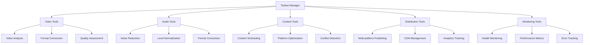

# Enhanced Toolset Design for Podcast Production

## Design Principles

### 1. Usability First

- **Intuitive Interfaces**: Tools should have clear, well-documented APIs
- **Consistent Patterns**: Follow established design patterns for predictability
- **Helpful Error Messages**: Provide actionable feedback when things go wrong
- **Progress Feedback**: Show status updates during long operations

### 2. Versatility

- **Multi-format Support**: Handle various input/output formats gracefully
- **Configurable Behavior**: Allow customization through configuration
- **Platform Agnostic**: Work across different operating systems and environments
- **Extensible Architecture**: Easy to add new features without breaking existing ones

### 3. Robustness

- **Comprehensive Error Handling**: Gracefully handle edge cases and failures
- **Resource Management**: Proper cleanup of files, connections, and memory
- **Validation**: Input validation at all levels
- **Fault Tolerance**: Continue operation when non-critical components fail

### 4. Informative Operations

- **Detailed Logging**: Provide meaningful logs for debugging and monitoring
- **Status Reporting**: Clear indicators of operation progress and completion
- **Result Documentation**: Well-structured output with metadata
- **Error Context**: Rich error information for troubleshooting

## Core Toolset Architecture



## Tool Design Specifications

### 1. Video Analysis Tool

**Purpose**: Analyze video files for speaker detection, scene segmentation, and quality assessment.

**Key Features**:

- Speaker detection and tracking across multiple camera angles
- Scene segmentation with semantic labeling (intro, interview, Q&A, etc.)
- Quality metrics: brightness, contrast, sharpness, stability
- Format validation and compliance checking
- Frame-by-frame analysis for detailed insights

**Error Handling**:

- Handle corrupt video files gracefully
- Provide meaningful error messages for unsupported formats
- Validate input paths and file permissions
- Timeout protection for long-running analysis

**Example Usage**:

```python
video_tool = VideoAnalysisTool(config)
result = video_tool.analyze_video(
    video_path="episode1.mp4",
    analysis_type="full",
    output_format="json"
)
```

### 2. Audio Processing Tool

**Purpose**: Process audio files with noise reduction, normalization, and quality enhancement.

**Key Features**:

- Adaptive noise reduction with configurable levels
- LUFS normalization for consistent loudness
- EQ presets for different voice types
- Clipping detection and repair
- Format conversion with quality preservation
- Batch processing capabilities

**Error Handling**:

- Detect and handle corrupt audio files
- Validate sample rates and bit depths
- Manage memory usage for large files
- Provide fallback processing when primary methods fail

**Example Usage**:

```python
audio_tool = AudioProcessingTool(config)
result = audio_tool.process_audio(
    audio_path="raw_audio.wav",
    noise_reduction="medium",
    target_lufs=-16,
    output_format="mp3"
)
```

### 3. Content Scheduling Tool

**Purpose**: Schedule content across multiple platforms with conflict detection and optimization.

**Key Features**:

- Multi-platform scheduling (Twitter, Instagram, YouTube, etc.)
- Content calendar management with visual interface
- Conflict detection and resolution suggestions
- Platform-specific optimization recommendations
- Time zone-aware scheduling
- Recurring content patterns

**Error Handling**:

- Validate platform credentials and API access
- Handle rate limiting and API errors gracefully
- Detect and prevent scheduling conflicts
- Provide clear error messages for invalid time slots

**Example Usage**:

```python
scheduling_tool = ContentSchedulingTool(config)
result = scheduling_tool.schedule_content(
    content_data={
        "title": "New Episode Alert",
        "description": "Check out our latest episode!",
        "media": "episode_thumbnail.jpg"
    },
    platforms=["twitter", "instagram", "youtube"],
    schedule_time="2026-01-08T15:00:00Z"
)
```

### 4. Distribution Management Tool

**Purpose**: Manage content distribution across platforms and CDN optimization.

**Key Features**:

- Multi-platform publishing with progress tracking
- CDN configuration and cache management
- Analytics integration for performance tracking
- Platform-specific metadata optimization
- Batch upload capabilities
- Version control for distributed content

**Error Handling**:

- Handle network connectivity issues gracefully
- Validate platform credentials and permissions
- Manage upload timeouts and retries
- Provide detailed error reports for failed uploads

**Example Usage**:

```python
distribution_tool = DistributionManagementTool(config)
result = distribution_tool.publish_content(
    content_package={
        "video": "episode_final.mp4",
        "audio": "episode_final.mp3",
        "metadata": "episode_metadata.json"
    },
    platforms=["youtube", "spotify", "apple_podcasts"],
    cdn_config={
        "cache_ttl": 3600,
        "edge_locations": ["us-east", "eu-west"]
    }
)
```

### 5. Monitoring and Diagnostics Tool

**Purpose**: Monitor system health, performance metrics, and error tracking.

**Key Features**:

- Real-time health monitoring of all tools
- Performance metrics collection and analysis
- Error tracking and trend analysis
- Resource utilization monitoring
- Alerting system for critical issues
- Historical data for troubleshooting

**Error Handling**:

- Handle monitoring service failures gracefully
- Validate metric data integrity
- Manage storage limits for historical data
- Provide fallback monitoring when primary systems fail

**Example Usage**:

```python
monitoring_tool = MonitoringTool(config)
result = monitoring_tool.get_system_health(
    components=["video_tool", "audio_tool", "scheduling_tool"],
    metrics=["cpu", "memory", "response_time"],
    time_range="last_24_hours"
)
```

## Error Handling Framework

### Error Severity Levels

```python
class ErrorSeverity(Enum):
    INFO = auto()        # Informational messages
    WARNING = auto()     # Recoverable issues
    ERROR = auto()       # Non-critical failures
    CRITICAL = auto()    # System-threatening failures
```

### Standardized Error Classes

```python
class ToolError(Exception):
    """Base exception with severity and context"""
    def __init__(self, message, severity=ErrorSeverity.ERROR, context=None):
        self.message = message
        self.severity = severity
        self.context = context or {}
        self.timestamp = time.time()

class RecoverableError(ToolError):
    """Errors that can be recovered from"""
    def __init__(self, message, context=None):
        super().__init__(message, ErrorSeverity.WARNING, context)

class ResourceError(ToolError):
    """Resource-related errors"""
    def __init__(self, message, resource, context=None):
        full_context = context or {}
        full_context['resource'] = resource
        super().__init__(message, ErrorSeverity.ERROR, full_context)

class ValidationError(ToolError):
    """Input validation failures"""
    def __init__(self, message, field, value, context=None):
        full_context = context or {}
        full_context['field'] = field
        full_context['invalid_value'] = str(value)
        super().__init__(message, ErrorSeverity.ERROR, full_context)
```

### Error Handling Best Practices

1. **Catch Specific Exceptions**: Handle known error conditions explicitly
2. **Provide Context**: Include relevant information in error messages
3. **Log Appropriately**: Use severity-appropriate logging levels
4. **Graceful Degradation**: Continue operation when possible
5. **User-Friendly Messages**: Translate technical errors for end users
6. **Recovery Options**: Provide suggestions for resolving issues

## Configuration Management

### Configuration Structure

```json
{
  "video": {
    "enabled": true,
    "max_file_size": "2GB",
    "supported_formats": ["mp4", "mov", "avi"],
    "analysis_presets": {
      "quick": { "resolution": "720p", "fps": 24 },
      "full": { "resolution": "1080p", "fps": 30 }
    }
  },
  "audio": {
    "enabled": true,
    "sample_rate": 48000,
    "bit_depth": 24,
    "noise_reduction_presets": {
      "light": { "threshold": -40 },
      "medium": { "threshold": -30 },
      "heavy": { "threshold": -20 }
    }
  },
  "scheduling": {
    "enabled": true,
    "platforms": {
      "twitter": { "api_key": "...", "max_length": 280 },
      "instagram": { "access_token": "...", "max_caption": 2200 }
    },
    "time_zones": ["America/New_York", "Europe/London"]
  }
}
```

### Configuration Validation

```python
def validate_config(config: Dict[str, Any]):
    """Validate toolset configuration"""
    required_sections = ["video", "audio", "scheduling"]

    for section in required_sections:
        if section not in config:
            raise ValidationError(
                f"Missing required configuration section: {section}",
                "config",
                config
            )

    # Validate video configuration
    video_config = config.get("video", {})
    if not isinstance(video_config.get("enabled", True), bool):
        raise ValidationError(
            "Video enabled must be boolean",
            "video.enabled",
            video_config.get("enabled")
        )

    # Additional validation rules...
```

## Performance Considerations

### Resource Management

1. **Memory Usage**: Monitor and limit memory consumption
2. **File Handles**: Ensure proper file handle cleanup
3. **Network Connections**: Manage connection pools efficiently
4. **CPU Utilization**: Implement throttling for CPU-intensive operations

### Caching Strategies

1. **Analysis Results**: Cache video/audio analysis to avoid reprocessing
2. **Configuration**: Cache parsed configuration data
3. **API Responses**: Cache platform API responses where appropriate
4. **Metadata**: Cache file metadata for performance

### Parallel Processing

1. **Batch Operations**: Process multiple files in parallel
2. **Platform Uploads**: Upload to multiple platforms concurrently
3. **Analysis Tasks**: Run different analysis types in parallel
4. **Resource Limits**: Respect system resource constraints

## Testing Strategy

### Unit Testing

- Test individual tool methods in isolation
- Mock external dependencies and file systems
- Validate error handling and edge cases

### Integration Testing

- Test tool interactions and workflows
- Validate end-to-end processes
- Test error propagation and recovery

### Performance Testing

- Measure execution times under load
- Test memory usage with large files
- Validate concurrent operation handling

### Regression Testing

- Ensure new features don't break existing functionality
- Test backward compatibility
- Validate configuration changes

## Documentation Standards

### Code Documentation

- Comprehensive docstrings for all public methods
- Type hints for function signatures
- Inline comments for complex logic
- Examples in docstrings

### User Documentation

- Clear installation instructions
- Usage examples with sample data
- Troubleshooting guides
- Configuration reference

### API Documentation

- OpenAPI/Swagger documentation for web services
- Interactive API explorers
- Versioned API documentation
- Deprecation notices

## Implementation Roadmap

### Phase 1: Core Tools

1. Video Analysis Tool
2. Audio Processing Tool
3. Basic Error Handling Framework
4. Configuration Management

### Phase 2: Content Management

1. Content Scheduling Tool
2. Distribution Management Tool
3. Platform Integration Layer
4. Conflict Detection System

### Phase 3: Monitoring and Optimization

1. Monitoring and Diagnostics Tool
2. Performance Optimization
3. Error Tracking System
4. Alerting Framework

### Phase 4: Testing and Documentation

1. Comprehensive Test Suite
2. User Documentation
3. API Documentation
4. Example Workflows

## Success Metrics

1. **Reliability**: 99.9% uptime for critical operations
2. **Error Rate**: Less than 1% of operations result in errors
3. **Performance**: 90% of operations complete within expected timeframes
4. **User Satisfaction**: Positive feedback from content creators
5. **Adoption Rate**: Tools used in 80% of production workflows
6. **Error Recovery**: 95% of recoverable errors handled automatically

## Maintenance Plan

### Versioning Strategy

- Semantic versioning (MAJOR.MINOR.PATCH)
- Backward compatibility within major versions
- Deprecation warnings for removed features

### Update Process

- Regular security updates
- Feature updates on schedule
- Hotfixes for critical issues
- Comprehensive changelogs

### Support Channels

- Documentation with troubleshooting guides
- Issue tracking system
- Community forums
- Dedicated support for critical issues

This design provides a comprehensive foundation for building robust, usable, and versatile toolsets that meet the requirements for podcast production workflows.
